<meta name="viewport" content="width=device-width, initial-scale=1.0"/>

# 목 차

[1. Hepatitis B Virus (HBV)](#1-hepatitis-b-virus-hbv)

[2. TB real time PCR](#2-tb-real-time-pcr)

[3. RV real time PCR](#3-rv-real-time-pcr)

[4. STD real time PCR](#4-std-real-time-pcr)

5.신종 코로나바이러스(COVID-19) PCR  
[5-1. 신종 코로나바이러스(COVID-19) PCR](#5-1-신종-코로나바이러스covid-19-pcr)  
(PowerChekTM SARS-CoV-2 Real-time PCR Kit, 코젠바이오텍)

[5-2. 신종 코로나바이러스(COVID-19) PCR](#5-2-신종-코로나바이러스covid-19-pcr)  
(STANDARD M nCoV Real-Time Detection kit , 에스디바이오센서)

[5-3. 신종 코로나바이러스(COVID-19) PCR](#5-3-신종-코로나바이러스covid-19-pcr)  
(Xpert Xpress SARS-CoV-2, Cepheid)

[5-4. 신종 코로나바이러스(COVID-19) PCR](#5-4-신종-코로나바이러스covid-19-pcr)  
(BioSewoom, Real-Q Direct SARS-CoV-2 Detection Kit)

[5-5. 신종 코로나바이러스(COVID-19) PCR](#5-5-신종-코로나바이러스covid-19-pcr)  
(STANDARD™ M10 SARS-CoV-2)

---
>분자진단 검사지침서

# 1. Hepatitis B Virus (HBV)

**[목차](#목-차)**

## 가. 검사명
Realtime PCR method 
1. 검사코드 : LPD194
2. EDI코드 : D7044030

## 나. 검사원리
Alinity m HBV는 실시간 중합효소연쇄반응(Real-Time Polymerase Chain Reaction)으로 사람 혈장, 혈청 검체에서 추출한 HBV DNA 게놈 서열을 중폭하고 검출한다.  
HBV DNA는 Alinity m Sample Prep Kit 2, proteinase K, Alinity m lysis solution, Alinity m Diluent Solution을 사용해 사람 혈청이나 혈장에서 추출된다. Alinity m System은 자성 미세입자 기술(magnetic microparticle technology)을 통해 핵산 포획, 세척 및 용리를 최적화한다.  
이를 통해 얻어진 추출, 핵산(nucleic acid)은 액상 형태의 1회 분량 Alinity m HBV 활성화 시약 및 동결건조 된 1회 분량 Alinity m HBV 증폭/검출 시약과 혼합된 후 반응 용기(rv)로 옮겨진다.  
반응 용기에 Alinity m Vapor Barier Solution이 첨가된 후 증폭/검출 유닛으로 옮겨져 PCR 증폭과 실시간 HBV 발광체 검출이 수행된다.  
HBV DNA 농도 측정을 위해 HBV 보정 곡선이 요구된다. 보정곡선 설정을 위해 2개 농도의 캘리브레이터가 검체 준비 및 PCR 절차로 처리된다.  
저장된 보정곡선을 기준으로 검체와 대조군 내 HBV DNA의 농도가 계산된다.  
혈청 또는 혈장 내의 HBV DNA는 핵산 증폭 또는 시그널 증폭 기술을 이용하여 정량 할 수 있다. Alinity M HBV Assay는 PCR 기술과 실시간 형광 검출 시스템을 조합하여 HBV DNA를 정량 검사할 수 있다.  
Surface 유전자에서 변하지 않는 부분을 선택하여 A에서 I까지의 genotype을 검출 할 수 있다.  
N terminal의 타겟 위치는 YMDD 돌연변이, HBsAg 돌연변이 또는 약제내성 돌연변이에 영향을 받지 않는다.  
이 검사는 WHO의 hepatitis B Virus DNA의 국제 기준을 따르고 있으며 결과는 IU/ml로 보고 할 수 있다

## 다. 임상적 의의
Hepatitis B Virus (HBV)는 B형 간염의 원인체로 알려져 있다. HBV 는 성적접촉, 감염된 혈액 또는 혈액이 포함된 제품에 노출되어 감염되거나 모체로부터 수직감염된다.    
HBV는 작고 둥글며, 약 3200 base pair 정도의 이중 나선 구조 DNA 바이러스입니다. 이 바이러스에 감염되면 만성감염, 간경화, 간암, 간 기능 부전, 심하면 사망에까지 이를 수 있다.  
HBV감염의 유병율과 전파 방법은 전세계적으로 매우 다양하다.  
높은 만성 HBV 감염 유병율을 보이는 나라에서의 가장 흔한 감염 경로는 신생아가 태어날 때 엄마에서 아이로, 또는 어린 시절 아이들끼리의 놀이에서 감염 될 수 있습니다.  
낮은 유병율을 보이는 지역에서는 감염은 일반적으로 어른이 되어 정맥 주사를 맞거나 높은 위험군의 성적행위로 인해 나타나는 경우가 있다.  
급성 간염에서 만성 간염으로 발전하는 경우는 감염된 엄마로부터 신생아가 감염되었을 때가 90%, 5세 이하 어린이들이 25~30%, 어른의 경우는 10% 정도입니다.  
면역력을 기르는 것은 HBV감염을 예방하는 가장 좋은 방법으로 성간염으로의 진행을 95%이상 방지할 수 있다.   
HBV DNA의 정량 검사는 만성 HBV감염 환자를 관리함에 있어서 매우 중요 합니다.  
현재 만성 HBV감염 환자의 HBV 바이러스 농도를 확인함에 있어서의 가이드라인에서는 치료에 대한 반응을 확인하면서 치료해야 한다고 권고하고 있다.  
반대로, 높은 수준의 바이러스 농도는 치료에 대한 저항뿐만 아니라 치료 후 재발을 예측할 수 있다.  
또한 hepatocellurlar carcinoma에 대한 독립적 위험 인자로서 확인 할 수 있습니다.  
현재 치료 조건은 interferon, peginterferon, 그리고 lamivudine, adeforivr 그리고 tenofovir와 같은 항바이러스 약을 포함하고 있다.

## 라. 검체조건
1. 종류: 혈청, 혈장
2. 채취용기
   1. 혈청 : 혈청, Rapid-clot Tube ( z-clot, thrombin 및 유사성분), 혈청 분리 튜브(SST)
   2. 혈장: 덱스트로오스 구연산염(ACD), K2 EDTA, K3 EDTA, 혈장 준비 튜브(PPT)
주의. 장비에는 검체 유형을 확인하는 기능은 없다. 
3. 보관조건 및 안정성  
   
**혈장검사**
   
| 검체종류 |    온도    | 최대 보관 기간 |                                                                       특별지침                                                                      |
|:--------:|:----------:|:--------------:|:---------------------------------------------------------------------------------------------------------------------------------------------------:|
| 전혈     |   2 – 8 ℃  |       2일      | 전혈 검체는 채혈과 혈장 분리 사이에 보관할 수 있다.                                                                                                 |
|          |  15 - 25 ℃ |       1일      |                                                                                                                                                     |
| 혈장     |    2-8℃    |       3일      | 혈장은 혈액세포로부터 분리된 후 1차 튜브 혹은 2차 튜브에서 보관할 수 있다.                                                                          |
|          |  15 - 25 ℃ |       1일      |                                                                                                                                                     |
|          |    -20 ℃   |      30일      | 혈장은 혈액세포로부터 분리된 후 1차 겔 튜브(PPT)에서 냉동보관 할 수 있다.   겔튜브가 아닌 튜브에 담겨있던 혈장은 보관 전에 2차 튜브로 옮겨야만 한다.  |
|          | -70 ℃ 이하 |    장기보관    |                                                                                                                                                     |

주의 3회 초과 반복된 냉/해동을 피한다.

**혈청검사**

| 검체종류 |    온도    | 최대 보관 기간 |                                                                      특별지침                                                                      |
|:--------:|:----------:|:--------------:|:--------------------------------------------------------------------------------------------------------------------------------------------------:|
| 전혈     |   2 – 8 ℃  |       2일      | 전혈 검체는 채혈과 혈청 분리 사이에 보관할 수 있다.                                                                                                |
|          |  15 - 25 ℃ |       1일      |                                                                                                                                                    |
| 혈청     |    2-8℃    |       3일      | 혈청은 혈전으로부터 분리된 후 1차 튜브 혹은 2차 튜브에서 보관할 수 있다.                                                                           |
|          |  15 - 25 ℃ |       1일      |                                                                                                                                                    |
|          |    -20 ℃   |      30일      | 혈청은 혈전으로부터 분리된 후 1차 겔 튜브(SST)에서 냉동보관 할 수 있다.   겔튜브가 아닌 튜브에 담겨 있던 혈청은 보관 전에 2차 튜브로 옮겨야만 한다.  |
|          | -70 ℃ 이하 |    장기보관    |                                                                                                                                                    |

주의 3회 초과 반복된 냉/해동을 피한다.

1. 검체의 준비
   1. 채취한 전혈 검체:  혈장이나 혈청을 분리하기 위해 원심분리 한다. 원심분리 후 , Alinity m System에 장착하거나 희석하기 전 혈장은 혈액세포에 포함된 채로(튜브 내에서 겔 유무 무관)보관할 수 있다.  
   원심분리 후, Alinity m System에 장착하거나 희석하기 전 혈청은 혈전에 포함된 채로 (튜브 내에서 겔 유무 무관) 보관할 수 있다.  
   참고: 혈액 세포나 혈전에 포함된 검체는 겔 없이는 냉동보관 할 수 없다.  
   혈장과 혈청 검체는 Alinity m System 에 장착되기 전이나 희석하기 전 2차 튜브로 옮겨서 보관할 수 있다. 장기간 보관해야 할 경우, 2차 튜브에 담긴 혈장과 혈청 검체를 냉동해서 보관할 수 있다.
   2. 냉동 검체: 1차 겔 튜브  
   검체를 15-25℃ 또는 2 -8 ℃ 에서 해동한다.  
   일단 해동되면, 검체는 즉시 검사되지 않을 경우, 2-8℃에서 최대 6시간까지 보관할 수 있다.  
   검체를 2, 3초간 3회 진탕(Vortex)한다.Alinity m System에 장착하기 전이나 검체 희석을 준비하기 전 1차 겔 튜브에 보관된 검체를 2000g에서 5분간 원심분리 한다.  
   혈전이나 파편이 보이면 검체의 상층액(supernatant)를 새 튜브에 옮겨 담는다.  
   새 튜브에 파편이나 혈전이 옮겨지지 않도록 한다.  
   3. 냉동 검체: 2차 소분 튜브  
   검체를 15-25℃ 또는 2-8℃에서 해동한다. 일단 해동되면, 검체는 즉시 검사되지 않을 경우, 2-8℃에서 최대 6시간 까지 보관할 수 있다. 각 검체를 2, 3초간 3회 진탕(vortex)한다. 파편이 보이면, 검체를 새 튜브에 옮겨 담는다. 새 튜브에 파편이 옮겨지지 않도록 한다. 

2. 부적합 검체기준
   1. 열-불활성화된 검체
   2. 육안상용혈된 검체 
   3. 명백히 미생물에 오염된 검체
   4. 사체 유래 검체 또는 사람 혈청이나 혈장을 제외한 다른 체액

## 마. 시약 
1. 시약명: Alinity m HBV Amp Kit 제품번호 08N47-90192회 검사 
2. 시약구성 및 조성  
Alinity m HBV Amp Kit은 2종류의 Multi–well 트레이로 구성된다.

|                           구성                           |                                                                                                                                                                                                                                                                   조성                                                                                                                                                                                                                                                                   |
|:--------------------------------------------------------:|:----------------------------------------------------------------------------------------------------------------------------------------------------------------------------------------------------------------------------------------------------------------------------------------------------------------------------------------------------------------------------------------------------------------------------------------------------------------------------------------------------------------------------------------:|
| Alintiy m HBV AMP KIT TRAY 1 x 4   4개 트레이/각 48회 검사 | 건조제 팩과 함께 박막 주머니에 개별 포장.   48회 분량의 동결건조된 증폭시약 well 및 48회 분량의 동결건조된 IC 및 Proteinase K 시약 well 로 구성된다.   1회 검사 시 각 well 이 하나씩 사용된다.    증폭시약 well은 합성올리고핵산염(oligonucleotides), DNA Polymerase, Uracil-DNA Glycosylase, 첨가제 및 dNTPs을 포함한 완충용액(reference dye 함유)로 구성.   내부 대조군(Internal control(IC))과 Proteinase K well은 비감염성 선형 플라스미드 DNA(linearized plasmid DNA), proteinase K 및 첨가제를 포함한 완충용액(Carrier DNA 함유)으로 구성. |
| Alintiy m HBV AMP KIT TRAY 2 x 4   4개 트레이/각 48회 검사 | 박막 주머니에 개별 포장 48회분량의 액체 활성화 시약 well로 구성된다.   1회 검사 시 각 well 이 하나씩 사용된다.  활성화 시약 well은 염화그네슘과 염화테트라메틸암모늄을 포함한다.     보존제: 0.15% ProClin 950                                                                                                                                                                                                                                                                                                                               |

3. 보관방법: 냉장(2~8℃) 보관
4. 유효기한: 미개봉시 냉장(2~8℃)에서 유효기한까지 사용한다.
5. Onboard stability(장착 후 안정성): 30일(유효기간을 초과할 수 없다)
6. 사용방법  
Alinity m System에 장착하기 전, 벤치에서 AMP TRAY 1 라벨이 위로 오도록 가장자리를 잡아서 3회 가볍게 두드린다. AMP TRAY 는 아래와 같이 원심분리 한다. 
   1. ACT TRAY 2를 플레이트 어댑터(384 well plate)에 장착한다. 
   2. (ACT TRAY 2가 장착된) 플레이트 어댑터를 플레이트 어댑터 수용가능한 스윙 플레이트 원심분리기에 장착한다. 기포를 제거하기 위해 100 – 800g 에서 1-5분간 원심분리한다. 
   3. 원심분리 직후 ACT TRAY 2를 조심스럽게 Alinity m Assay Tray Carriers로 옮긴다. ACT TRAY 2가 흔들리지 않도록 주의한다. Alinity m System Operations Manual에 따라 캐리어에 장착한다. 
   4. 만약 트레이를 옮기는 중 기포가 생길 수 있는 방해(예: ACT TRAY 2가 떨어지거나, 부딪히거나, 뒤집혔을 경우)를 받았다면 ACT TRAY 2를 재원심분리한다.
   5. Alinity m System Operations Manual 시약 및 검체 재고관리의 지침에 따라 검사를 진행한다. 검체를 검사하기 전 캘리브레이션과 컨트롤 상태를 점검한다. 재캘리브레이션이나 컨트롤 검사가 필요한 경우 지침서 Calibration 및 내부정도관리에 따라 처리한다. 캘리브레이션과 컨트롤은 검체의 존재와 상관없이 검사할 수 있다. 

## 바. Calibration
1. 물품명: Alinity m HBV CAL Kit
2. 구성 및 용량

|  구성 |     용량    |        농도       |
|:-----:|:-----------:|:-----------------:|
| CALA  | 4 x 1.65 mL | 약 2.53 Log IU/mL |
|  CALB | 4 x 1.65 mL | 약 6.42 Log IU/mL |

Alintiy m System에서 검사 캘리브레이션을 수행할 때 필요하다. Alinity m System은 각 캘리브레이터 튜브에서 3회 반복검사를 수행한다. 2개(CAL A, CALB)의 캘리브레이터에서 얻은 데이터를 이용하여 보정곡선을 작성한다.(양성 농도의 발광신호가 검출되었을 때 로트 특이적인 HBV 농도 대 임계치 사이클[Ct]). 보정곡선의 기울기와 절편이 계산되고 장비에 저장된다. 일단 검사 캘리브레이션이 수락되고 저장되면, 다음의 상황이 발생하는 경우를 제외하고는 추가 캘리브레이션 없이 계속해서 검체를 검사할 수 있다. 

3. 주기
   1. 신규 로트 번호의 Alinity m HBV AMP Kit 을 사용한다.
   2. 신규 로트 번호의 Alinity m Sample Prep Kit 2 또는 Alinity m Lysis Solution 을 사용한다. 
   3. 검사 캘리브레이션이 만료되었다. 
   4. 신규 버전의 Alinity m HBV Application Specification File이 설치 되었다. 본 검사는 주요 부품이나 하위시스템에 대한 정비 또는 서비스 절차를 수행한 후에 캘리브레이션을 다시 수행해야 할 수도 있다. 
4. 보관조건
   1. 개봉 전: 냉동(-20± 5°C)/유효기한까지
   2. 개봉 후: 냉동(-20± 5°C)/유효기한까지
   3. 사용 후 폐기한다.  
5. 시행방법
   1. 본 제품은 환자 검체와 동일하게 취급되어야 하고 장비, 키트 또는 사용되는 시약과 함께 제공되는 설명서에 따라 검사해야 한다.
   2. 컨트롤을 실온(18 - 25°C)에서 30분 동안 또는 완전히 해동될 때까지 거치한다. 컨트롤은 사용 전 완전히 용해되어야 한다. 
   3. 캘리브레이션 오더 등 장비 운용에 관한 내용은 ’Alinity m Operation manual ‘을 참고한다.

억제 검출 (Detection of Inhibition)내부 대조군 임계치 사이클(IC threshold cycle [Ct]) 검사의 유효성 파라미터는 캘리브레이션 수행 중 수립된다. 올바른 검체 처리와 검사 유효성을 확인하기 위해 미리 정의된 일관적인 내부 대조군(IC)이 검체 준비 단계에서 각 검체, 캘리브레이터 및 컨트롤에 추가되어 Alinity m System에 의해 측정된다.캘리브레이터 검체로부터 얻은 IC Ct 중간값으로 연속해서 처리될 검체와 컨트롤에 대한 IC Ct 유효성 범위를 확립할 수 있다. 검체나 컨트롤의 IC Ct 값이 IC Ct 유효성 범위를 벗어나면 메시지 코드(Message Code)가 부여된다. IC Ct 값이 IC Ct 유효성 범위의 상한을 초과하면 비정상적인 검사 상태(억제등)을 시사한다. 

## 사. 정도관리법
1. 물품명: Alinity m HBV CTRL Kit
2. 구성 및 용량

|        구성       |     용량     | 농도  (Log IU/mL) | 범위 (Log IU/mL) |
|:-----------------:|:------------:|:-----------------:|:----------------:|
|    HBV NEG CTRL   | 12 x 1.15 mL |    Not detected   |   Not detected   |
|  HBV LOW POS CTRL | 12 x 0.45 mL |    약 2.53 Log    |    ± 0.75 Log    |
| HBV HIGH POS CTRL | 12 x 0.45 mL |    약 4.47 Log    |    ± 0.75 Log    |

3. 주기: 검사 성능의 모니터링을 위해 Alinity m HBV Negative CTRL, Low Positive CTRL 및 High Positive CTRL을 최소 48시간마다 1회 이상의 빈도로 검사하는 것이 권장된다. 검체 결과값을 보고하기 전 모든 컨트롤 농도에 대한 유효한 결과값을 확보하여야 한다. 
4. 수정 조치사항: 유효하지 않은 컨트롤 결과값이 생성된 검체에는 플래그가 표시된다. 유효하지 않은 컨트롤 결과값에 이어 검사된 모든 검체는 재검해야 한다. 내부정도관리지침 참조
5. 보관조건
본 제품은 3개의 레벨(Negative CTRL, Low Positive CTRL 및 High Positive CTRL )이 12 셋트로 구성되어 있으며, 1회 1셋트 검사 후 폐기한다. 
   1. 개봉 전: -20± 5°C 에서 유효 기한까지 안정하다.
   2. 개봉 후: -20± 5°C 에서 유효 기한까지 안정하다. 
6. 시행방법
   1. 본 제품은 환자 검체와 동일하게 취급되어야 하고 장비, 키트 또는 사용되는 시약과 함께 제공되는 설명서에 따라 검사해야 한다. 
   2. 컨트롤을 실온(18 - 25°C)에서 30분 동안 또는 완전히 해동될 때까지 거치한다. 컨트롤은 사용 전 완전히 용해되어야 한다. 
   3. 사용 전 캡을 제거한다. 사용 후 즉시마개를 닫고 폐기한다. 
   4. 음성 컨트롤에서 HBV가 검출되어서는 안된다. 
   5. 음성 컨트롤에서 HBV 검출될 경우 다른 검체나 증폭 제품에 의한 오염을 시사한다. 오염을 방지하기 위하여, Alinity m System 을 청소하고 검체와 컨트롤의 처리를 반복한다. 증폭 검사 제품의 존재에 대한 모니터링 절차는 Alinity m System 사용설명서를 참고한다. 
   6. 일련의 검사 컨트롤이 처리중일 때 Alinity m HBV 저농도 양성 컨트롤과 Alinity m 고농도 양성 컨트롤의 로트 특이적인 농도값은 바코드를 스캔하여 확인한다. 

## 아. 검사방법
1. Alinity m System에 장착하기 전, 벤치에서 Alinity m HBV AMP TRAY 1 라벨이 위로 오도록 가장자리를 잡아서 3회 가볍게 두드린다. 
2. ACT TRAY 2를 플레이트 어댑터 수용 가능한 스윙 플레이트 원심분리기에 장착한다.
3. 기포를 제거하기 위해 100 - 800g 에서 1 - 5분간 원심분리한다.
4. 원심분리 직후 ACT TRAY 2를 조심스럽게 Alinity m Assay Tray Carriers로 옮긴다. (ACT TRAY 2가 흔들리지 않도록 주의한다.)
5. 만약 트레이를 옮기는 중 기포가 생길 수 있는 방해(예: ACT TRAY 2가 떨어지거나, 부딪히거나, 뒤집혔을 경우)를 받았다면 ACT TRAY 2를 재원심분리한다.
6. 검체를 검사하기 전 캘리브레이션과 컨트롤 상태를 점검한다. 
7. Create Order 화면에서, 검사 중인 검사(HBV)를 선택한다. 
8. 검체 TRAY에 컨트롤과 검체를 넣은후 장비에 장착한후 RUN 버튼을 누른다.
8. 검체 준비 과정과 유전자증폭 및 검출 과정은 모두 Alinity m system을 통해 수행한다.
9. Alinity m System은 증폭시약, 캘리브레이터, 컨트롤 및 검체가 장착되어 있는 동안 장착 시 보관 기간을 자동으로 추적한다.

## 자. 계산법
정량 바이러스량 결과 값은 검사의 정량 범위 내의 HBV 바이러스 농도와 함께 혈장 및 혈청 검체에 대하여 보고된다. 검체의 HBV DNA 농도는 장비 소프트웨어에 의하여 보정곡선을 이용하여 계산된다. 
Alinity m System은 단위(International Units) IU/ mL 또는 Log [IU/mL]로 결과 값을 보고한다.
검체 희석 절차를 통하여 검사된 검체의 경우, Alinity m System은 검사자가 선택한 희석배수를 역산하여 미희석(희석 전) 상태에 해당하는 결과값을 보고한다.

## 차. 참고치
HBV DNA real time PCR : < 10 IU/mL 

## 카. 측정가능범위
1. AMR(Analytical measure ablerange):            10 IU/mL (정량 한계 – LoQ) – 1,000,000,000 IU/mL           1.00 Log IU/ml – 9.00 Log IU/ml
   1. HBV 측정값이 1,000,000,000 IU/mL을 초과하는 검체의 경우,“> ULoQ” 코드로 표시되고, 수동 희석절차(Manual Dilution Procedure)로 희석할 수 있다.
   2. 수동 희석 절차: 수동 희석 절차는 다음과 같다.

수동 희석 절차
권장 희석 배수: ① 1:10, ② 1:100
① 900 μL의 DW 또는 PBS 에 100 μL의 환자검체를 추가하여 충분한 진탕(Vortex) 후 검사한다.
② ①번 10배희석 검체 100 μL를 DW 또는 PBS 에 900 μL에 넣어 충분한 진당(Vortex)후 검사한다.

2. 최소 정량 한계 (LoD)
 HBV 음성 사람 혈장 및 혈청에 준비된 핵산 증폭기술(Nucleic Acid Amplification Techniques (NIBSC Code: 10/264; genotype A))을 위한 B형 간염 바이러스에 대한 3rd Wirld Health Organization (WHO) 국제 표준(International Standard)에 따라 희석된 검체를 검사하여 최소 검출 한계(LoD)를 결정하였다. 4개 로트의 증폭 시약으로 수일간 각 HBV DNA 농도를 검사하였다. Alinity m HBV 검사의 대표적인 분석적 민감도 성능결과 값은 아래의 표에 요약되어 있다. 

표1. 혈장에서의 Alinity m HBV 검출 한계 (LOD) 

| HBV DNA  (IU/mL)  | 유효한 반복  검사 갯수 | 검출 갯수   |  검출률 (%) |
|:-----------------:|:----------------------:|:-----------:|:-----------:|
|       15.00       |            94          |      92     |     97.9    |
|       10.00       |            95          |      95     |    100.0    |
|        7.00       |            95          |      92     |     96.8    |
|        4.00       |            94          |      80     |     85.1    |
|        2.00       |            93          |      63     |     67.7    |
|        1.00       |            95          |      39     |     41.1    |
|        0.50       |            94          |      18     |     19.1    |

프로빗 분석(Probit analysis)을 통해 95% 확률 (LoD by Probit)로 검출된 혈장 내 HBV DNA 농도를 6.72 IU/mL (95% CI 5.28 - 9.27 IU/mL)로 결정하였다. 

표2. 혈청에서의 Alinity m HBV 검출 한계 (LOD) 

| HBV DNA  (IU/mL)  | 유효한 반복  검사 갯수 | 검출 갯수   |  검출률 (%) |
|:-----------------:|:----------------------:|:-----------:|------------:|
|       15.00       |  96                    |      95     |     99.0    |
|       10.00       |  95                    |      91     |     95.8    |
|        7.00       |  95                    |      89     |     93.7    |
|        4.00       |  96                    |      83     |     86.5    |
|        2.00       |  93                    |      59     |     63.4    |
|        1.00       |  92                    |      47     |     51.1    |
|        0.50       |  94                    |      35     |     37.2    |

프로빗 분석(Probit analysis)을 통해 95% 확률 (LoD by Probit)로 검출된 혈청 내 HBV DNA 농도를 9.62 IU/mL (95% CI 7.14 – 14.43 IU/mL)로 결정하였다.
3. 유전자형별 최소 검출 한계 (LoD)(유전자형 B, C, D, E, F, G, H 및 I 에 대한 최소 검출 한계 
유전자형 B, C, D, E, F, G, H 및 I 에 해당하는 HBV 임상검체를 HBV 음성 혈장 및 혈청에서 3가지 농도로 희석했다. 1개 로트의 증폭시약을 이용하여 수일간 검사를 수행했다. 유전자형 B, C, D, E, F, G, H 및 I 에 대한 Alinity m HBV 검사로 혈장과 혈청에서 10 IU/ml 이상의 HBV를 검출할 수 있음을 나타낸다. (기대 비율 95.0% 이상의 단측 상한 95% 신뢰구간)

표3. 혈장에서의 Alinity m HBV 유전자형 검출 한계(LOD)

| 유전자형 | HBV  DNA  (IU/mL)  | 유효한  반복 검사  갯수   | 검출 갯수     |             검출률(%) |     95% CI  (%)a      |
|:--------:|:------------------:|:-------------------------:|:-------------:|----------------------:|:---------------------:|
|     B    |  20.00 10.00 7.00  |        29 30   30         |  29 30   30   | 100.0 100.0   100.0   |  100.0 100.0   100.0  |
|     C    |  20.00 10.00 7.00  |        30 30   29         |  30 30   28   |  100.0 100.0   96.6   |  100.0 100.0   99.2   |
|     D    |  20.00 10.00 7.00  |        30 30   30         |  30 29   30   |  100.0 96.7   100.0   |  100.0 99.3   100.0   |
|     E    |  20.00 10.00 7.00  |        30 30   30         |  30 30   29   |  100.0 100.0   96.7   |  100.0 100.0   99.3   |
|     F    |  20.00 10.00 7.00  |        30 30   30         |  30 30   30   | 100.0 100.0   100.0   | 100.0 100.0   100.0   |
|     G    |  20.00 10.00 7.00  |        30 30   30         |  30 30   30   | 100.0 100.0   100.0   | 100.0 100.0   100.0   |
 

a 단측 상한 95% 신뢰 구간(%).
                    
표4. 혈청에서의 Alinity m HBV 유전자형 검출 한계(LOD)

| 유전자형   | HBV  DNA  (IU/mL) | 유효한  반복 검사  갯수   | 검출 갯수     |        검출률(%)      |     95% CI  (%)a      |
|:----------:|:-----------------:|:-------------------------:|:-------------:|:---------------------:|:---------------------:|
|      B     |  20.00 10.00 7.00 |        30 30   30         |  30 29   29   |  100.0 96.7   96.7    |  100.0 99.3   99.3    |
|      C     |  20.00 10.00 7.00 |        30 28   28         |  30 28   27   |  100.0 100.0   96.4   |  100.0 100.0   99.2   |
|      D     |  20.00 10.00 7.00 |        28 29   29         |  28 26   28   |  100.0 89.7   96.6    |  100.0 89.7   96.6    |
|      E     |  20.00 10.00 7.00 |         30 29 30          |   30 29 27    |   100.0 100.0 90.0    |   100.0 100.0 90.0    |
|      F     |  20.00 10.00 7.00 |        30 30   29         |  30 30   28   |  100.0 100.0   96.6   |  100.0 100.0   96.6   |
|      G     |  20.00 10.00 7.00 |        30 30   29         |  30 30   29   | 100.0 100.0   100.0   | 100.0 100.0   100.0   |
|      H     |  20.00 10.00 7.00 |        29 30   30         |  29 29   28   |  100.0 96.7   93.3    |  100.0 96.7   93.3    |
|         I  |  20.00 10.00 7.00 |        29 30   29         |  29 30   26   |  100.0 100.0   89.7   | 100.0 100.0   100.0   |

a 단측 상한 95% 신뢰 구간(%)혈장과 혈청에서 Alinity m HBV의 최소 검출 한계(LOD)는 10 IU/mL 이다. 
4. 검사의 한계
   1. 최적의 검사 성능을 위해서는 적절한 검체 채취와 취급이 필요하다. 본 검사지침서의 검체 준비방법을 참고한다. 
   2. Alinity m HBV 검사에서는 사람 혈청 검체(혈청 분리관이나 rapid-clot 튜브에 채취된 혈청 포함)와 혈장(ACD, EDTA, PPT)검체를 사용할 수 있다. 다른 종류의 혈장 및 혈청 튜브 사용은 평가되지 않았다.
   3. 혈청 및 혈장 검체의 파편(혈전, 섬유소 가닥 등)이 검체처리에 간섭을 일으킬 수 있다. 
   4. HBV 검사 결과가 다른 임상 증거와 부합하지 않으면, 결과를 확인하기 위한 추가 검사가 권장된다. 
   5. 장비와 검사 절차를 따름으로써 증폭 제품에 의한 오염 가능성을 줄일 수 있다. 그러나 캘리브레이터, 양성 컨트롤 또는 검체로 인한 핵산 오염 방지는 우수검사실 관행에 따라 통제해야 한다. 

## 타 주의사항
1. 간섭물질(Interference materials)
가) 잠재적 교차반응물질Alinity m HBV의 분석적 특이도는 HBV 음성 혈장에 포함된 미생물(표7 참고) 패널, HBV 농도 30 IU/mL의 양성 혈장과 HBV 농도 2,000 IU/mL의 양성 혈장을 이용하여 평가 되었다. 검사 된 미생물에 대하여 Alinity m HBV 검사 성능에 대한 교차반응성이나 간섭현상은 측정되지 않았다. 

표 7. 미생물

| 바이러스                                                                                 | 바이러스                                                                                                                                                                                            |
|------------------------------------------------------------------------------------------|-----------------------------------------------------------------------------------------------------------------------------------------------------------------------------------------------------|
| Adenovirus Type 5                                                                        | Influenza   A                                                                                                                                                                                       |
| BK Polyomavirus                                                                          | Japanese   Encephalitis                                                                                                                                                                             |
| Dengue Virus 1                                                                           | Murray   Valley Encephalitis                                                                                                                                                                        |
| Dengue Virus 2                                                                           | Virus   Parvo Virus B19                                                                                                                                                                             |
| Dengue Virus 3                                                                           | Rubella   Virus                                                                                                                                                                                     |
| Dengue Virus 4                                                                           | St.   Louis Encephalitis                                                                                                                                                                            |
| FSME Virus                                                                               | Vaccinia   Virus                                                                                                                                                                                    |
| GB Virus C/Hepatitis G Virus Hepatitis A Virus                                           | Varicella-Zoster                                                                                                                                                                                    |
| Hepatitis C Virus                                                                        | Virus   West Nile                                                                                                                                                                                   |
| Hepatitis D Virus                                                                        | Virus   Yellow                                                                                                                                                                                      |
| Human Herpesvirus 1/Herpes Simplex Virus 1                                               | Fever   Virus Zika Virus                                                                                                                                                                            |
| Human Herpesvirus 2/Herpes Simplex Virus 2                                               | 　                                                                                                                                                                                                  |
| Human Herpesvirus 5/Human Cytomegalovirus                                                | 　                                                                                                                                                                                                  |
| Human Herpesvirus 4/Epstein Barr Virus                                                   | 　                                                                                                                                                                                                  |
| Human Herpesvirus 6B                                                                     | 　                                                                                                                                                                                                  |
| Human Herpesvirus 8                                                                      | 　                                                                                                                                                                                                  |
| Human Immunodeficiency Virus 1   Human Immunodeficiency Virus 2     Human Papilloma Virus 16 | 　                                                                                                                                                                                                  |
| Human Papilloma Virus 18                                                                 | 박테리아                                                                                                                                                                                            |
| Human T-Lymphotropic Virus                                                               | Chlamydia   trachomatis Corynebacterium diphtheria MNeisseria gonorrhoeae Mycobacterium   smegmatis Neisseria   gonorrhoeae Propionibacterium acnes Staphylococcus aureus Staphylococcus   epidemidis |
| Human T-Lymphotropic Virus 2                                                             | Streptococcus   pneumonia                                                                                                                                                                           |
| 　                                                                                       | 미생물                                                                                                                                                                                              |
| 　                                                                                       | Trichomonas   vaginalis                                                                                                                                                                             |
| 　                                                                                       | 효모                                                                                                                                                                                                |
| 　                                                                                       | Candida   albicans                                                                                                                                                                                  |

2. 잠재적 간섭 물질
내인성 물질, HBV와 관련 없는 질환의 존재, 백신 접종 상태, 고농도의 HBV 및 관련 질환에 일반적으로 처방되는 약물의 존재로 인한 간섭 효과가 평가되었다. Alinity m HBV 검사에 대한 잠재적인 간섭 현상은 HBV 음성 검체와 HBV 농도 30-2000 IU/ml 양성 검 체를 검사하여 평가되었다.알부민(60 mg/mL), 헤모글로빈(2 mg/mL), 트리글리세리드(37 mM), 포합 빌리루빈 (0.342 mM), 비포합 빌리루빈(0.342 mM), 사람 게놈 DNA(2 mg/L)에 의한 간섭 현상은 측정되지 않았다. 다음의 질병 상태를 가진 환자 검체로부터 간섭 현상은 측정되지 않았 다: 전신홍반성루푸스(systemic lupus erythematosus, SLE), 항핵항체(anti-nuclear antibodies, ANA), 류머티스인자(rheumatoid factor, RF), 알코올성 간염, 비알콜성 지방 간염(non-alcoholic steatohepatitis, NASH), 간경변, 자가면역간염 또는 간세포암종 (hepatocellular carcinoma, HCC). 또한, 인플루엔자 및 B형 간염 백신 접종자로부터 채취 한 검체에서의 간섭 현상도 측정되지 않았다.

표 8에 기재된 검사된, 보고된 Cmax의 3배 농도 이상의 약물 화합물에 의한 간섭 현상은 측정되지 않았다.

표 8. 약물 화합물

| 검사된  풀 |                                                                                                                              약물 화합물                                                                                                                             |
|:----------:|:--------------------------------------------------------------------------------------------------------------------------------------------------------------------------------------------------------------------------------------------------------------------:|
|      1     | Abacavir sulfate, Acetaminophen, Acyclovir, Adefovir,  Amitriptyline,   Amlodipine, Aspirin, Atazanavir, Atenolol,  Atorvastatin, Azithromycin,Celecoxib, Cidofovir, Clarithromycin , Clopidogrel                                                                      |
|      2     | Didanosine, Efavirenz, Entecavir, Fluconazole, Fluoxetine,  Ibuprofen,   Indinavir, Kaletra (Lopinavir and Ritonavir),  Lamivudine, Levofloxacin, Maraviroc, Nelfinavir, Nevirapine, Paroxetine                                                                        |
|     3      | Prednisone, Raltegravir, Ribavirin, Rifamate (Rifampin  and Isoniazid), Saquinavir,    Sertraline, Stavudine, Stribild  (Elvitegravir, Cobicistat, Emtricitabine, and Tenofovir), Bactrim  (Sulfamethoxazole and Trimethoprim)                                          |
|      4     | Darunavir, Ethambutol, Etravirine, Flucytosine,  Fluticasone propionate, Furosemide,    Hydrochlorothiazide, Levothyroxine, Rifabutin, Rilpivirine, Salmeterol xinafoate, Simeprevir,  Sofosbuvir, Telaprevir, Tenofovir alafenamide, Trazodone, Warfarin, Zalcitabine  |
|      5     | Fosamprenavir, Keflex (Cephalexin), Metformin, Naproxen, Pyrazinamide                                                                                                                                                                                                |
|      6     |  Tipranavir                                                                                                                                                                                                                                                          |
|      7     | Ceftriaxone, Ciprofloxacin, Foscarnet, Lisinopril, Peginterferon alfa-2a, Enfuvirtide, Imipramine                                                                                                                                                                    |
|      8     | Cyclosporine, Telbivudine, Valacyclovir, Valganciclovir,  Zidovudine, Amphotericin B, Ganciclovi                                                                                                                                                                     |
|      9     |  Hydrocodone                                                                                                                                                                                                                                                         |
|     10     |  Biotin                                                                                                                                                                                                                                                              |
     
## 파. 검사해석
각 검체에 대해 Alinity m System은 결과와 해석을 보고한다. 필요한 경우 메시지 코드나
플래그가 표시될 수도 있다.
1. 미희석 검체인 경우

Alinity m System 에서의 보고 

|         결과값         |      해석      | 플래그 (Flag)  |
|:----------------------:|:--------------:|:--------------:|
|         미검출         |  목표   미검출 |                |
|   〈 1.00 Log IU/mL    | 검출   < LLOQ  |                |
| 1.00 - 9.00 Log IU/mL  |                |                |
|    > 9.00 Log IU/mL    |     > ULOQ     |                |

2. 희석 검체인 경우
희석된 검체에 대해서는 장비에서, (이용 가능한 경우) 그에 대한 해석과 검체가 희석되었
음을 나타내는 DIL플래그를 표시된다. 보고된 정량 결과 값과 정량 범위의 상/하한(각각
ULOQ 및 LLOQ)는 희석 전 검체의 HBV DNA 농도가 반영된 것이다.
HBV 신호가 검출되지 않은 희석된 검체에 대해서는 어떤 결과 값도 보고되지 않는다. 이
런 검체들은 "목표 미검출 (Target not detected)"로 해석될 수 없으며 미희석 검체 상태나
새로 희석한 검체를 이용하여 재검사해야 한다.
   1. 1:2.5로 희석된 검체

Alinity m System 에서의 보고 

|         결과 값        |      해석      | 플래그 (Flag)  |
|:----------------------:|:--------------:|:--------------:|
|   〈 1.40 Log IU/mL    | 검출   < LLOQ  |       DIL      |
| 1.40 - 9.40 Log IU/mL  |                |       DIL      |
|    > 9.40 Log IU/mL    |     > ULOQ     |       DIL      |

   2. 1:50로 희석된 검체

Alinity m System 에서의 보고 

|         결과 값         |      해석      | 플래그 (Flag)  |
|:-----------------------:|:--------------:|:--------------:|
|    〈 2.70 Log IU/mL    | 검출   < LLOQ  |       DIL      |
| 2.70 - 10.70 Log IU/mL  |                |       DIL      |
|    > 10.70 Log IU/mL    |     > ULOQ     |       DIL      |

참고: 희석된 검체의 정량 범위 상/하한(각각 ULOQ 및 LLOQ)은 희석하지 않고 검사한 검체의 Alinity m HBV 검사 ULOQ 및 LLOQ와 다르다. 해당하는 값은 각 표의 결과 값(Result) 열에 표시된다.

## 하. 참고문헌
1. Liang TJ, Hepatitis B: the virus and disease. Hepatology 2009;49(5):S13-21.
2. Lok AS, McMahon BJ, Practice Guidelines Committee American Association for the Study of Liver Diseases. Chronic hepatitis B. Hepatology 2001;34(6):1225-41.
3. Hepatitis and Liver Cancer: A National Strategy for Prevention and Control of Hepatitis B and C. Colvin AM, Mitchell AE, eds. Washington, DC: National Academies Press; 2010.
4. World Health Organization: Media centre; Hepatitis B Fact Sheet. 
http://www.who.int/mediacentre/factsheets/fs204/en/. Accessed March 29, 2017. Updated 18 July 2018.
5. Gentile I, Borgia G. Vertical transmission of hepatitis B virus: challenges and solutions. Int J Womens Health 2014;6:605-11.
6. Srivastava A, Mathias A, Yachla SK, et al. Need for immunization against hepatotropic viruses in children with chronic liver disease. J Pediatr Gastroenterol Nutr 2014;59(3):393-7.
7. Yeung LT, Roberts EA. Current issues in the management of paediatric viral hepatitis. Liver Int 2010;30(1):5-18.
8. Schweitzer A, Horn J, Mikolajczyk RT, et al. Estimations of worldwide prevalence of chronic hepatitis B virus infection: a systematic review of data published between 1965 and 2013. Lancet 2015;386(10003):1546-55.
9. Terrault NA, Bzowej NH, Chang KM, et al. AASLD guidelines for treatment of chronic hepatitis B. Hepatology 2016;63(1):261-83.
10. Laoi BN, Crowley B. Molecular characterization of hepatitis B virus (HBV) isolates, including identification of a novel recombinant, in patients with acute HBV infection attending an Irish hospital. J Med Virol 2008;80(9):1554-64.
   
---
>분자진단 검사지침서

# 2. TB real time PCR
M. Tuberculosis (PCR & Hybridization)  
**[목차](#목-차)**
## 가. 검사법
Real Time PCR
1. 검사코드 : LPD194
2. EDI코드 : D7044030

## 나. 검사원리
PCR과 Taqman chemistry를 사용한다. PCR 반응동안 IS6110과 rpoB region에 특이적인 primer에 의해 반응 산물이 형성되며, 이와 동시에 각 유전자에 특이적인 Taqman probe 가 분해됨으로써 형광이 형성된다.  
형성된 형광을 real time PCR cycler로 측정한다.

## 다. 임상적의의
결핵은 결핵균(M. tb)에 의해 일어나는 전염성 질환으로 가장 많이 발견되는 폐 이외에도 림프절, 흉막, 골관절, 신장, 뇌막, 복막, 소장, 대장, 난관, 피부 등 모든 장기에 감염되며,임상증상도 다양하다.  
일반적 증상은 피로, 쇠약, 체중 감소, 발열이다. 폐에 감염되면 만성 기침이 있고 병이 더 진행되면 혈담이 관찰된다.  
한편 비결핵 마이코박테리아(NTM; nontuberculous mycobacteria)는 토양이나 물 등 생활환경에 널리 존재하는 비병원성 균으로 인식되어 왔다.  
그러나 1980년대 후천성면역결핍증이 유행하면서 이와 관련한 NTM 유발 질환이 증가하였고, 임상적 중요성에 대한 인식과 배양법의 발달에 따라 HIV sero-negative 환자에서도 폐질환, 궤양성 질환, 염증성 장질환 등을 유발함이 보고되었다. 또한 이들 NTM은 대부분 결핵균 치료제에 저항성을 가지고 있다.  
따라서, 우리나라에서도 매년 NTM 유발 질환이 증가함에 따라 결핵균과 NTM 을 구별할 수 있는 진단법과 이를 통한 구별된 치료법 적용의 필요성이 증가하고 있다.  
결핵의 진단법으로는 환자의 임상증상, X-선 촬영, 객담염색법, 객담의 결핵균 배양, PCR법 등이 행해지고 있다.  
이들 방법 중 객담염색법은 간편하고 빠르게 결과를 얻을 수 있으나 결핵균과 NTM을 구별할 수 없으며, 배양법은 4주 이상 소요되는 문제점이 있다.

## 라. 검체조건
1. 채혈용기 : 객담, 기관지 세척액, 뇌척수액, 소변
 단 전혈일 경우 EDTA 용기
2. 검체운송 : 실온에서 6시간 이내에 운송하여 2~8℃에 보관
3. 검체보관
   1. 전처리 전 : 2~8℃ 48시간
   2. 전처리 후 : 2~8℃ 7일

4. 마. 시약
   1. 제조원 : LG생명과학
   2. 판매처 : 한울바이오
   3. 보관 및 저장방법
- 조제한 시약의 저장 방법 및 사용기간

|조제시약|저장방법|사용기간|
|---|---|---|
|시료전처리액1|상온|12시간|
|시료전처리액2|상온|1개월|

- 개봉된 시약의 저장 방법 및 사용기간

|            시약명           |  저장방법 |               사용기간               |
|:---------------------------:|:---------:|:------------------------------------:|
| 시료전처리액1(10배 농축액)  |    상온   | 개봉 후 3 개월, 키트의 유효기간 이내 |
| 시료전처리액2(10배 농축액)  |    상온   | 개봉 후 3 개월, 키트의 유효기간 이내 |
| Extraction Buffer           | -20℃ 이하 | 개봉 후 3 개월, 키트의 유효기간 이내 |
| 2X PCR Mixture              | -20℃ 이하 | 개봉 후 3 개월, 키트의 유효기간 이내 |
| TB/NTM primer/probe Mixture | -20℃ 이하 | 개봉 후 3 개월, 키트의 유효기간 이내 |
| TB/NTM PositiveControl      | -20℃ 이하 | 개봉 후 3 개월, 키트의 유효기간 이내 |
| TB/NTM NegativeControl      | -20℃ 이하 | 개봉 후 3 개월, 키트의 유효기간 이내 |

5. Calibration
정성검사이므로 해당사항 없음

6. 정도관리
   1. 내부정도관리물질 및 허용범위

|내부정도관리물질|내부정도관리허용범위|빈도|
|---|---|---|
|Negative,Positive|NC(TB:No Ct, NTM: No Ct,IC:Target±3SD)   PC(TB,NTM,IC:Target±3SD)|검사 시행시마다 (46검체마다)|

   2. 내부정도관리
      1. Kit내에 포함된 양성, 음성 정도관리 물질을 환자 검체와 같이 검사한다.
      2. 검사실 허용범위내에 있음을 확인 한 후에 환자 결과를 보고한다.
      3. 허용범위를 벗어난 경우
 허용범위를 벗어난 경우 재검을 시행하고 허용범위 내에 들지 않을 경우 시약 및 검사진행 과정중의 문제점을 확인한다.
   새로운 Kit로 검사하여 허용범위내에 들면 내부정도관리이상처리기록서에 기록하고, 허용범위를 벗어난 경우 UM과 전문의에게 보고하고 시약회사나 장비회사에 연락하여 조치를 취한다.
      - 정도관리 물질이 허용 범위안에 들어올 때까지 환자 검사 결과는 보고하지 않는다.
      - 즉시 검사가 불가능한 환자검체는 검체내 구성 물질이 변질되지 않도록 냉장 보관을 유지한다.
      - 모든 시약과 정도관리 물질의 유효기간을 확인한다.
      - Technique, reagents, calibration등의 검사 수행을 정확히 하였는지 확인한다.
      - 정도관리 분석을 다시 한다.
       - 만일 새 측정치가 범위내에 들면 결과를 QC 차트에 기록하고 환자검사를 보고한다
 ( 첫 번 측정치는 random error-20회 검사중 한번의 확률의 가능성이 높(3)
      - 만일 새 측정치가 계속 상하한치를 벗어나면 검사를 보류한다.
      - 만일 새 측정치가 여전히 상하한치를 벗어나면 다음과 같은 원인을 예상하고 조치한다.
 검사 장비의 이상 유무 ( 검사기기에 대한 적절한 Maintenance를 수행한다.)
 Standard 혹은 control의 이상 유무
 검사시약의 이상 유무 ( 새로운 시약으로 교체 후 recalibration을 하고 Control 재검)
 문제점의 원인을 분석한 내용과 조치사항, 처리결과, 검사자등을 내부정도관리이상처리 기록서에 기록하고 UM, 전문의에게 보고한다.
      4. 상기의 모든 사항에서 이상이 발견되면 즉시 조치를 취하고 기록을 남기며 이모든 과정을 적극적으로 관리하며 책임진다.
      5. 정도관리 오류대책
      - 검사 전 오류 : 정도관리 물질의 변질 여부 확인, Lot No 및 유효기간 확인,
시약 및 검체 보관조건 합당한지 확인
      - 검사 후 오류 : 정도관리 결과가 Mean±3SD를 벗어난 경우 계통오차와 우연오차의 발생을 감지하고 결과 보고를 보류한다.
Systematic error : 개인적인 습관, 측정기기의 계통적 부정확성, 시약의 불량, 측정환경의 계통적인 부적격성, 측정법 자체의 습성

* Control을 대상으로 반응하였을 때의 signal(Ct 값) 형성은 다음과 같아야 한다.

|||형광||
|:----------------:|:-------:|:--------:|:--------:|
|       항목       | FAM(TB) | HEX(NTM) | Cy5(IC*) |
| Positive Control |    +    |     +    |    +/-   |
| Negative Control |    -    |     -    |     +    |

*
   3. 외부정도관리 : 운영지침서 참고
   4. 허용범위 설정 방법
      1. 새로운 Lot No가 교체되기 전 5번 시행 후 Mean과 SD를 산정한다. SD는 이전에 사용한 결과값으로 대체하여 임시 사용 할 수 있다.
      2. 정도관리 물질의 누적자료가 20개가 되었을 때 Mean±3SD를 산정하고 전문의와 상의 후 검사실 허용범위로 사용한다.
   5. Cut off 검증방법
      1. 농도별 희석방법
         1. 표준균주를 증류수에 현탁
         2. Mcfarland Nephlometer를 이용하여 탁도를 0.5로 조절(1X10^8 cells/mL)
         3. PBS를 이용하여 10배씩 계단희석하여 10^1까지 1ml를 제조한다.
         4. 준비된 균주로 DNA추출 후 PCR검사를 진행한다.
         5. TB real time PCR cut off 검증쉬트에 결과 입력 후 허용기준을 확인한다.
         6. 허용기준: Ct값<35.0, (r값>0.975, PBS희석액-No Ct)
      2. ±20% 구간 반복측정법
         1. 제조사에서 제공한 물질을 이용하여 원액(+20) 10회 100배희석액(-20) 10회를 반복 측정한다.
         2. 희석액은 3차 증류수, 또는 Elution buffer를 사용한다.
         3. 허용기준 : Ct값<35.0 (+)20% 구간에서 All Positive, (-)20% 구간에서 All Negative

- PBS를 이용한 희석방법

| No | 최종농도(cells/ml) | 표준균주 현탁액 | PBS buffer |
|:--:|:------------------:|:---------------:|:----------:|
|  1 |        10^8        |     10^81mL     |      -     |
|  2 |        10^7        |    10^8 100ul   |    900ul   |
|  3 |        10^6        |    10^7 100ul   |    900ul   |
|  4 |        10^5        |    10^6 100ul   |    900ul   |
|  5 |        10^4        |    10^5 100ul   |    900ul   |
|  6 |        10^3        |    10^4 100ul   |    900ul   |
|  7 |        10^2        |    10^3 100ul   |    900ul   |
|  8 |         50         |    10^2 500ul   |    500ul   |
|  9 |         10         |     50200ul     |    800ul   |
| 10 |         PBS        |        0        |   1000ul   |

## 아. 검사방법
1. 필요 용액 준비
   1. Extraction buffer 준비: 시험을 시작하기 전 상온에 방치한다.
   2. 시료 전처리액 1 준비: 객담 또는 기관지 세척액 시료가 있을 경우에 사용하고자 하는 시료의 수에 따라 시료 전처리액 1(10배 농축액)을 증류수에 10배의 비율로 필요한 양만큼 희석한다. 1개의 시료 당 시료 전처리액 1(10배 농축액) 600㎕를 증류수 5.4㎖에 희석하면 충분하다. 이 용액은 사용 전에 제조하여야 하며 12시간 이상 경과한 경우에는 폐기한다.
   3. 시료 전처리액 2 준비: 사용하고자 하는 시료의 수에 따라 시료 전처리액 2(10배 농축액)을 증류수에 10배의 비율로 필요한 양만큼 희석한다. 1개의 시료 당 시료전 처리액 2(10배 농축액) 500㎕를 증류수 4.5㎖에 희석하면 충분하다. 이 용액은 상온에서 보관 시 1개월 동안 안정하다.
   4. 2X PCR mixture : 4℃ 또는 상온에 방치하여 해동시킨다. 상온의 경우 1시간이상 방치하지 않는다.
   5. TB/NTM primer/probe Mixture : 4℃ 또는 상온에 빛으로부터 차단하고 방치하여 해동시킨다. 상온의 경우 1시간이상 방치하지 않는다.
   6. TB/NTM Positive control : 4℃ 또는 상온에 방치하여 해동시킨다. 상온의 경우 1시간 이상 방치하지 않는다.
   7. TB/NTM Negative control : 4℃ 또는 상온에 방치하여 해동시킨다. 상온의 경우 1시간 이상 방치하지 않는다.

2. 검체의 전처리
   1. 객담, 기관지 세척액
      1. 객담이나 기관지 세척액 3ml에 시료전처리액1 3ml를 첨가한 후 vortex를 이용하여 강하게 섞어준다. 이후에 5분간 상온에 방치하면서 1분 간격으로 30초간 vortex를 이용하여 강하게 섞어준다.
      2. 3,000rpm으로 20분 동안 원심분리하고 상층액을 제거한다.
      3. 시료전처리액1 1ml를 첨가한 후 pipet을 이용하여 침전물을 섞은 후 1.5 ml microtube로 옮긴다.
      4. 5분간 상온에 방치하면서 1분 간격으로 30초간 vortex를 이용하여 강하게 섞어준다.
      5. 13,000 rpm에서 3분 동안 원심분리하고 상층액을 제거한다.
      6. 남아있는 침전물은 DNA 추출에 사용한다.
   2. 뇌척수액, 소변 등 각종 체액
      1. 최대한 많은 양의 시료를 13,000 rpm에서 3분 또는 3,000rpm에서 20분 동안 원심분리하고 상층액을 제거한다.
      2. 남아있는 침전물은 DNA 추출에 사용한다.
   3. 혈액
      1. 1.5ml microtube에 EDTA-혈액 1.0 ml를 넣고 -20℃에서 4시간 또는 -70℃에서 2시간동안 냉동시킨다.
      2. 냉동된 혈액을 상온에서 완전히 녹여 용혈시킨 후 13,000 rpm에서 3분 동안 원심분리한다.
      3. 상층액을 제거하고 멸균증류수 1.0 ml를 첨가한다.
      4. vortex를 이용하여 강하게 30초 동안 섞은 후 13,000rpm에서 3분 동안 원심분리하고 상층액을 제거한다.
      5. 적혈구가 완전히 제거될 때까지 (다)-(라)번 과정을 반복한다.
      6. 남아있는 침전물은 DNA 추출에 사용한다.
3. Mycobacteria DNA의 추출
      1. 전처리 과정 후 남아 있는 침전물을 vortex한 후 1.5ml microtube에 옮긴다.
      2. 시료 전처리액2 1.0 ml를 첨가하여 vortex를 이용하여 강하게 10초 동안 섞은 후, 13,000rpm에서 3분 동안 원심분리 하고 상층액을 제거한다.
      3. 위의 두번째 과정을 2번 반복한다.
      4. Extraction buffer 50㎕를 잘 흔들어 섞은 후 1.5㎖ microtube에 첨가한다.
(Extraction buffer의 resin은 쉽게 침전하므로 filter tip을 사용하여 각 시료 별로 2-3회 pipetting을 이용해 잘 흔들어 사용한다.)
(침전물의 양이 많을 경우 Extraction buffer 100㎕를 첨가한다.)
      5. 100℃에서 20분간 가열한다.(microtube의 뚜껑이 열리지 않도록 주의)
      6. 13,000rpm에서 1분 동안 원심분리하고, 10초 동안 vortex하여 잘 섞어준다.
      7. 13,000rpm에서 3분 동안 원심분리 하여 분리된 상층액 5㎕를 PCR에 사용한다.
4. PCR 반응
   1. 2X PCR Mixture가 10㎕씩 분주되어 있는 200㎕ PCR tube를 시료의 수 만큼 준비한다.
   2. TB/NTM primer/probe Mixture 5㎕를 각각의 PCR tube에 첨가하고, 추출한 Mycobacteria 시료 DNA 5㎕를 첨가한다.
   3. 뚜껑을 닫고 원심분리 한 후 vortex하여 잘 섞어준다.
 (혼합하지 않을 경우 baseline 형성에 영향을 미치므로 반드시 섞어준 후 PCR 반응을 진행)
   4. 원심분리 한 후 Real time PCR machine에 넣어 반응을 진행한다
(뚜껑이 제대로 닫히지 않은 경우 실험실 오염 및 baseline 상승으로 인한 결과 분석 오류가 생길 수 있으므로 반드시 tube의 뚜껑을 한번 더 눌러서 뚜껑을 제대로 닫는다.)

5. PCR 결과 측정
PCR 반응 결과는 real time PCR cycler에 의해 실시간으로 측정된다.

* 기기별 한계값

|기기명||한계값||
|:----------:|:----:|:----:|:----:|
||  FAM |  HEX |  Cy5 |
| SLAN(LGLS) | 0.09 | 0.09 | 0.09 |

* 기기별 양성 판정 기준 Ct 값

|기기명||한계값||
|:----------:|:----:|:----:|:----:|
||  FAM |  HEX |  Cy5 |
| SLAN(LGLS) | 35 | 35 | 35 |

## 자. 결과 분석
1. 각 반응별로 FAM, HEX 및 Cy5 파장의 signal 형성을 확인하여 아래 표와 같이 반응 유효성과 양성, 음성을 분석한다.

|||형광|||
|:-----------------:|:-------:|:--------:|:--------:|:---------------------------------------:|
|        항목       | FAM(TB) | HEX(NTM) |  Cy5(IC) |                   비고                  |
| Positive  Control |    +    |     +    | +/- => + |                반응 유효                |
|  Negative Control |    -    |     -    |     +    |                반응 유효                |
|        시료       |    +    |     +    |     +    | (TB complex and NTM) or TB complex only |
|        시료       |    +    |     +    |     -    | (TB complex and NTM) or TB complex only |
|        시료       |    +    |     -    |     +    |             TB complex only             |
|        시료       |    +    |     -    |     -    |             TB complex only             |
|        시료       |    -    |     +    |     +    |                   NTM                   |
|        시료       |    -    |     +    |     -    |                   NTM                   |
|        시료       |    -    |     -    |     +    |                 Negative                |
|        시료       |    -    |     -    |     -    |                  재시험                 |

2. TB와 NTM의 Ct 값으로 아래와 같이 결과를 분석한다

|   |       MTB complex       |      NTM      |     Interpretation    |                   비고                  |
|:-:|:-----------------------:|:-------------:|:---------------------:|:---------------------------------------:|
| 1 |          No Ct          |     No Ct     |        negative       |                반응 유효                |
| 2 |      Ct value < 35      |     No Ct     | MTB complex infection |                반응 유효                |
| 3 |          No Ct          | Ct value < 35 |     NTM infection     | (TB complex and NTM) or TB complex only |
| 4 |      Ct value < 35      | Ct value < 35 |                       | (TB complex and NTM) or TB complex only |
| 4 | “NTM Ct값– TB Ct값” ≤ 0 |               |  MTB&NTM co-infection |             TB complex only             |
| 4 | 0 < “NTM Ct값– TB Ct값” |               |      MTB complex      |             TB complex only             |

## 차. 참고치
M. Tuberculosis real time PCR : Negative

## 카. 참고문헌
1. S.Y. Se Thoe et al, Evaluation of Amplicor- and IS6110-PCR for direct detection of Mycobacterium tuberculosis complex in Singapore,
TropicalMedicineandInternationalHealth,
2:1095-1101
2. L.E. Desjardin et al, Comparison of the ABI 7700 system and competitive PCR for Quantification of IS6110 DNA in sputum during Treatment of tuberculosis, Journalof clinical microbiology, 36 : 1964-1968
3. Sujatha Narayanan et al, Evaluation of PCR using TRC4 and IS6110 primers in detection of tuberculosis meningitis, Journal of clinical microbiology, 39 : 2006-2008
4. Dagmar Rimek et al, Performance of an IS6110-based PCR assay and the COBAS AMPLICOR MTB PCR system for detection of Mycobacterium tuberculosis ComplexDNA in Human lymph node samples, Journal of clinical microbiology, 40 :3089-3092
5. Soumitech Chakravoty et al, Diagnosis of extrapulmonary tuberculosis by smear,culture and PCR using universal sample processing technology, Journal of clinicalmicrobiology, 43 : 4357-4362
6. 이준구외다수,객담도말 음성인 폐결핵환자의 기관지세척액에서 Amplicor PCR과 IS6110 PCR의 임상적 유용성에 관한 비교 연구, 결핵 및 호흡기 질환, 50 : 213-221
7. Paul H.M. SavelKoul et al, Detection of Mycobacterium tuberculosis complex with real time PCR : comparison of different primer-probe sets based on the IS6110 element, journal of microbiological methods, 2005 : 1-4
8. Andrea Gori et al, Specific detection of Mycobacterium tuberculosis by mtp40 nested PCR, journal of clinical microbiology, 34 : 2866-2867
9. V.M. Katoch, Newer diagnostic techniques for tuberculosis, Indian J. Med. Res.120 : 418-428
10. Basudev Bhattacharya et al, Development of a new sensitive and efficient multiplex polymerase chain reaction for identification and differentiation of different mycobacterial species, Tropical Medicine and International Health, 8 : 150-157
11. V. C. C. Cheng et al, Molecular diagnostics in tuberculosis, Eur. J. Clin. Microbiol. Infect. Dis., 24 : 711-720

---
>분자진단 검사지침서

# 3. RV real-time PCR
RV real-time PCR (Multiplex)  
**[목차](#목-차)**
## 가. 검사법
Real Time PCR
1. 검사코드 : LPD194
2. EDI코드 : D7044030

## 나. 검사원리
RV (Respiratory Virus)-plus real-time RT-PCR 은 real-time PCR은 택맨 화학기술(Taqman chemistry technology)과 바이러스 타임에 특이적인 시퀀스를 보유한 프라이머 /프로브 세트를 사용한다.  
본 검사시약은 호흡기 바이러스 2종(Adeno virus, Boca virus)에 대한 DNA유전자 부위를 검출한다.나머지13종(Corona Virus : 229E, OC43, NL63, Parainfluenza Virus : PIV1, 2, 3, Influenza A, B, Respiratory Syncytial Virus A, B, Metapneumo Virus, Adeno Virus, Rhino Virus (A,B,C), Boca Virus, Entero virus) 의 호흡기 바이러스 특정 유전자 부위에 RNA부위는 역전자 반응(reverse-transcripition,RT)을 통해 cDNA (complentary DNA)를 합성한다. 합성된 cDNA는 특정 프라이머와 함께 실시간으로 각 타켓 PCR 반응물을 생성한다.  
그 와 동시에 유전자에 특이적인 텍맨 프로브는 분해되면서 형광을 나타낸다. 형광의 강도는 실시간 PCR검사기기에 의해 측정된다. Advans Sure RV –plus real-time RT-PCR은 검체로부터 추출된 RNA의 역전사 반응과 다중 PCR반응이 하나의 튜브안에서 수행된다. 또한 내부대조물질로 RNase-p를 사용하여 RNA추출과정의 유효함에 대한 정보를 제공하고, 샘플링 에러와 RT-PCR 반응 에러로 인해 잘못된 판정을 내리는 것을 방지한다.

** 유전자 부위**
1. 코로나 바이러스 229E, OC43 : 핵단백질(N) 유전자(nucleoprotein (N) gene)
2. 코로나 바이러스 NL63 : 폴리단백질 (1a) 유전자(polyprotein (1a) gene)
3. 인플루엔자 A 바이러스 : 기질 단백질(M) 유전자(matrix protein (M) gene)
4. 인플루엔자 B 바이러스 : 헴어글루티닌(HA) 유전자(hemagglutinin (HA) gene)
5. 파라인플루엔자 바이러스 1,2,3 : 헴어글루티닌-뉴라미니다제(HN)
유전자(hemagglutinin-neuraminidase (HN) gene)
6. RS 바이러스 A, B : 융합 단백질 유전자(fusion protein gene)
7. 아데노 바이러스 : 헥손 단백질 유전자(hexon protein gene)
8. 라이노 바이러스 A, B, C : 5'UTR
9. 메타뉴모바이러스 : 핵단백질(N) 유전자(nucleoprotein (N) gene)
10. 보카 바이러스 : nucleocapsid protein (NP) gene, Viral protein (VP) gene
11. Entero virus :

## 다. 임상적 의의
1. Corona Virus(229E, OC43, NL63)
: 제 3 위험군으로 Coronaviridae과 Coronavirus속으로, 단일가닥 (+)RNA 바이러스로서 형태가 다양하고 피막이 있으며 왕관 모양이다.  
사람에게는 거의 감염되지 않고 주로 동 물에 감염되는 병원균으로 인식되어 왔다. 감염될 때에는 감기나 인두염 같은 감염증을 유도하여 코감기, 코막힘, 기침, 목아픔 등의 증세를 나타내기도 하나 50%는 무증상으로 자연 치유되는 바이러스이다.
한국의 소아 급성 호흡기 감염에서는 드문 병원체이지만 2003년 3월 중순 처음으로 발생해 세계적으로 100명이 넘는 사망자와 3,000여 명의 환 자를 발생시킨 중증급성호흡기증후군(사스)의 원인균이 변종 코로나바이러스인 것으로 알려지면서 주목 받기 시작하였다.

2. Parainfluenza Virus (1,2,3)
: 파라인플루엔자 바이러스는 인플루엔자 바이러스와 유사한 바이러스이다. 추로 급성 호 흡기질환을 유발하는데, 영아 및 소아에서는 급성 하기도 질환을 유발하며, 면역기능이 저하된 성인 및 고 연령층에서도 상기도 질환을 유발하는 것으로 알려져 있다.  
혈청 형 은 1,2,3형 및 4형의 4가지가 존재하는데 각 혈청 형은 항원성, 임상 징후 및 유행양상에 있어서 많은 차이를 나타낸다.
1형은 2년 주기로 여름과 가을에 유행하여 소아에게 주로 후두기관지염을 일으키고, 2형은 1형과 유사한 임상징후를 보이지만 그 빈도와 징후가 더 심한 것으로 알려져 있다.  
3형은 연중 산발적으로 발생하지만 우리나라에서는 5월 전 후에 주로 발생하는 것으로 보고되고 있다.  
생후 6개월 미만의 영아에서 기관지염, 세기 관지염 및 폐렴등의 하기도 감염을 일으킨다. 특히 3형은 모체 항체가 남아 있는 영아기 에도 감염되어 영아 하기도 감염의 주요한 원인체로 알려져 있다.  
4형은 감염이 빈법하 게 일어나는 것으로 알려져 있으나 대개는 뚜렷한 임상 증상이 없으며 세포 배양이 어렵 기 때문에 정확한 진단에 많은 어려움이 있다.

3. Influenza A/B
: 독감의 주 원인균인 인플루엔자 바이러스는 핵단백(nucleoprotein)에 의해 A,B,C 형으로 대별된다.  
A형 envelope에는 적혈구응집소(hemagglutinin:HA)와 neuraminidase(NA)의 spike 가 존재하고, 그것들의 항원성에 의해 아형으로 나뉜다.  
HA는 H1에서 H13, NA는 N1에서 N9까지 나눈다. 세계적으로 유행되는 것은 A형과 B 형인데, 백신은 이들을 대상 으로 접종한다. 인플루엔자는 감기 증후군 virus 감염증의 하나이기 때문에 재채기, 콧물, 인후통, 기침, 발열등의 임상 증상으로 독감 또는 감기로 취급된다.  
Type A는 11월부터 5월까지 검출되고, type B는 주로 초봄에 유행, 10월부터 6월까지 검출, 2년 간격으로 나타나기도 한다.
건강한 사람에서는 심한 감기 정도로 대수롭지 않게 여겨질 수 있으나 당뇨병, 심장병, 만성폐질환, 만성신부전 및 면역억제제 복용자등은 폐렴등 합병증으로 사망하는 것을 방 지하기 위해 백신 예방 접종이 중요하다.

4. RSV A/B
: 영아기 하기도 감염의 가장 중요한 원인 바이러스이며 심각도는 해마다 다르나 매년 호흡기 질환을 일으키는 병원체이다.  
감염 시 임상 증상은 가벼운 상기도 감염에서 심한 하기도 감염에 이르기까지 다양하며 재감염이 될수록 증상은 경미해지나 재감염율이 높은 바이러스이다.  
대부분 6개월 경의 영아에서 생기며 주로 늦가을에서 초봄 사이에 호 발하며 감염의 시작은 대개 급격하고 유행은 평균 2-5 개월 정도 지속된다.  
감염의 치료 는 합병증이 동반하지 않는 경우에는 대중 요법으로 치료하나, 호흡기포체바이러스감염 으로 인한 증상의 심각성을 줄이고 위험군의 유병률 및 사망률을 줄이기 위해 한때 ribavirin의 투여가 시도되었으나 치료 효과가 부족하다는 보고에 따라 더 이상 치료제로 권고되고 있지 않다

5. Boca Virus
: 2005년 호흡기 감염 환아의 비인두흡인물에서 발견된 바이러스로 동시 감염률이 40% 로 다른 호흡기 바이러스와 함께 검출되는 경우가 많다.  
실제 병을 일으키는 원인이 되 는지 불확실하며 늦 봄과 초여름의 중요 호흡기 병원체 일 수도 있다. 호흡기, 혈액과 대 변에서 검출되어 전신질환을 유발할 수도 있다.  
주로 다른 호흡기 감염 환아에서 동시 감염되는 경우가 많으며 지역적으로 검출률의 차이가 크다.

6. Adeno Virus
: 아데노바이러스는 직경 80~110nm의 double stranded DNA 바이러스로 호흡기질환, 위장관질환, 결막염, 뇌막염, 뇌염등의 중추신경계통 질환, 방관염과 간염등의 다양한 종 류의 질환들을 일으키며 면역저하자 환자에서는 치명적일 수 있다.  
전 연령층에서 발생 가능하나 일반적으로 연령이 증가하면서 감소하는 경향을 보이며 호발 연령은 6개월에 서 5세 사이이고 6개월 이하에서는 모체에서 받은 중화항체 때문에 감염의 빈도가 낮지 만, 일단 신생아에서 발생하면 심한 증상이 나타나며 때로 치명적일 수 있다.  
아데노바이 러스는 연중 발생하며 소아호흡기 질환의 2~5% 정도의 원인이 되고 소아페렴의 8~20% 를 차지하고 있다.  
아데노바이러스 폐렴의 치료에는 ribavirin, 면역글로블린등이 효과가 있으나 그 치료방법이 정립되어 있지 못한 상황이다.

7. Rhino Virus A,B,C
: 소아와 성인 모두에서 감기(바이러스성 상기도 감염)의 가장 흔한 원인이며, 100가지 이상의 혈청형이 존재한다.  
예방이 어려우며, 혈청 형의 구분 어렵다. 기관지염, 모세기관 지염, 기관지 폐렴이 보고되어 있으며, 성인에서 천식과 만성폐질환의 악화를 초래할 수 있다고 알려져 있다.  
상기도염에서는 가장 흔한 원인이지만 하기도염에서의 비중은 이에 비해 낮습니다.  
그러나 세기관지염의 원인으로는 RSV 다음으로 두 번째이며, 폐렴의 원 인으로도 RSV 다음 ADV, Inf B와 함께 두 번째입니다.

8. MPV
: 유아와 소아에서 가장 흔한 하기도 관련질환 호흡기바이러스로 늦겨울에서 3, 4, 5월사 이에 발생하는 소아 천명, 모세기관지염, 폐렴, 그리고 천식 등의 증상을 보이는 하기도 호흡기 질환의 원인이다.  
hMPV 감염증을 가진 소아의 평균 연령은 RSV 감염증 소아의 평균 나이보다 높고(3개월 vs 11.5개월), hMPV의 최고 활동 성이 RSV의 활동성의 최고 점보다 다소 늦은 계절에 나타나기도 하지만 RSV와 유사하게 겨울과 초봄이 가장 발병 빈도가 높다고 보고 되고 있고 RSV 와 동시 감염 시 보다 심각한 결과를 초래한다.
9. Entero virus
: 사람 및 포유류 질병과 관련된 (+)ssRNA 바이러스의 일종이다. 장염을 일으키는 바이러스이기에 '장바이러스'라는 명칭으로도 불리는데, 엔테로바이러스는 혈청형에 따라 약 71여종으로 분류한다. 폴리오바이러스의 임상적 중요성 때문에 폴리오바이러스와 비폴리오바이러스로 분류한다.
이러한 장바이러스는 다양한 바이러스를 포함하지만, 새롭게 발견된 것에 대해서는 EV68, 71, 73이라고 명명하고 있다. 수족구병의 원인이기도 하다. 뇌수막염과 장염, 포진성 구협염 등을 일으킨다. 비교적 안전된 바이러스로 실내 온도에서 수 일간 생존 가능하다. 바이러스 잠복기는 3~7일로 불리며, 대부분 발열 등의 가벼운 증상을 일으킨다.

## 라. 검체
1. 검체용기 : UTM용기
2. 검체운송 : 실온에서 6시간 이내에 검사실로 운송하여 2~8℃ 10일간 안정
-15℃이하에서 1개월간 안정
3. 검체의 냉동 해동에 따른 안정성 : -25℃~ -15℃에서 3회까지 가능
4. 검체종류 : Nasal 및 Throat swab

## 마. 시약
1. 구성물:

| 번호 | 시약명                         | 구성성분                                                                                                                                                  |
|------|--------------------------------|-----------------------------------------------------------------------------------------------------------------------------------------------------------|
| 1    | RT-PCR Premix Buffer           | One-step RT-PCR premix buffer                                                                                                                             |
| 2    | RT-PCR Premix Enzyme           | One-step RT-PCR premix enzyme                                                                                                                             |
| 3    | RV프라이머/프로브 혼합액 A     | 1. PIV1 primer/probe mix (FAM)2.   PIV2 primer/probe mix (HEX)3. NL63 primer/probe mix (ROX)4. PIV3 primer/probe   mix (Cy5)                          |
| 4    | RV프라이머/프로브 혼합액 B     | 1. Influenza A pirmer/probe mix   (FAM)2. RNase P primer/probe mix (HEX)3. Enterovirus primer/probe mix (ROX)4.   Influenza B primer/probe mix (Cy5)                   |
| 5    | 프라이머/프로브   혼합액 C     | 1. RSV A primer/probe mix (FAM)2. Boca Virus primer/probe mix   (HEX)3. OC43 primer/probe mix (ROX)3. RSV B primer/probe mix (Cy5)                        |
| 6    | 프라이머/프로브   혼합액 D     | 1. Adeno Virus primer/probe mix   (FAM)2.Rhino Virus A,B,C primer/probe mix (HEX)3.229E primer/probe mix   (ROX)4.Metapneumo virus primer/probe mix (Cy5)                   |
| 8    | 양성대조액(Positive   Control) | Positive control containing 15types of Respiratory Virus, RNase P   primer/probe binding sequences                                                        |
| 9    | 음성대조액(Negative   Control) | Negative control containing RNase P primer/probe binding sequences                                                                                        |

2. 성상
   1. RT-PCR Premix Buffer: 무색의 액체
   2. RT-PCR Premix Enzayme: 무색의 액체
   3. 프라이머/프로브 혼합액 1~5 : 무색의 액체
   4. 양성대조액 : 무색의 액체
   5. 음성대조액 : 무색의 액체

3. 보관 :
PCR kit는 -20℃ 이하의 냉동에 보관한다.

## 바. Calibration
정성검사이므로 해당사항 없음

## 사. 정도관리
1. 내부 정도관리 : 매회 시행하고 음성, 양성 대조는 각각 일치하는 결과이어야 한다.
매 실험마다 kit에 첨부된 음성대조, 양성대조를 같이 검사하고 internal
control의 증폭여부도 같이 평가한다.
- 임상 시료에서 IC 가 검출되지 않으면서 특정 바이러스에서도 검출되지 않는 경우는 시료의 탈락세포의 양이 적은 경우이므로 1ml의 시료를 13000rpm 에서 1~3분간 원심 분리하고, 800㎕의 상층액을 제거한 후 추출에 사용하여야 한다.
농축하여 재검한 후에도 RNase P 가 안 나올 경우는 검체를 재 채취 한다.
- RNase P signal (Internal control) 이 나오지 않았더라도, Virus 양성일 경우에는 재시 험 대상이 아니다

Kit내에 공급하고 있는 Positive control의 Ct 값

| 양성대조액               | FAM    | HEX    | CY5    |
|--------------------------|--------|--------|--------|
| 프라이머/프로브 혼합액 A | 20 ± 3 | 20 ± 3 | 20 ± 3 |
| 프라이머/프로브 혼합액 B | 20 ± 3 | 20 ± 3 | 20 ± 3 |
| 프라이머/프로브 혼합액 C | 20 ± 3 | 20 ± 3 | 20 ± 3 |
| 프라이머/프로브 혼합액 D | 20 ± 3 | 20 ± 3 | 20 ± 3 |

Kit내에 공급하고 있는 Negative control의 Ct 값

| 음성대조액               | FAM   | HEX    | CY5   |
|--------------------------|-------|--------|-------|
| 프라이머/프로브 혼합액 A | No Ct | No Ct  | No Ct |
| 프라이머/프로브 혼합액B  | No Ct | No Ct  | No Ct |
| 프라이머/프로브 혼합액C  | No Ct | 20 ± 3 | No Ct |
| 프라이머/프로브 혼합액D  | No Ct | No Ct  | No Ct |

2. 내부정도관리 벗어난 경우의 대책
   1. 정도관리 물질의 내부정도관리가 벗어나면 검사결과를 보고하지 않는다.
   2. 즉시 검사가 불가능한 환자검체는 검체내 구성 물질이 변질되지 않도록 냉장 보관한다.
   3. 모든 시약과 정도관리 물질의 유효기간을 확인한다.
   4. Technique, reagents 등의 검사 수행을 정확히 하였는지 확인한다.
   5. 정도관리 분석을 다시 한다.
   6. 만일 새 측정치의 결과가 맞으면 환자검사를 보고한다
   7. 만일 새 측정치가 계속 허용범위를 벗어나면 검사를 보류한다.
   8. 만일 새 측정치가 여전히 허용범위를 벗어나면 다음과 같은 원인을 예상하고 조치한다.
- 검사 장비의 이상 유무 ( 검사기기에 대한 적절한 Maintenance를 수행한다.)
- control의 이상 유무
- 검사시약의 이상 유무 ( 사용되지 않은 새로운 시약으로 교체 후 Control 재검)

- 문제점의 원인을 분석한 내용과 조치사항, 처리결과, 검사자, 검사시간등을 내부정도관리 이상처리기록서에 기록하고 UM, 전문의에게 보고한다.
- 상기의 모든 사항에서 이상이 발견되면 즉시 조치를 취하고 기록을 남기며 이모든 과정을 적극적으로 관리하며 책임진다.

3. 외부정도관리 : 운영지침서 참고

4. Cut off 검증
   1. 농도별 희석방법
      1. 연 2회 실시한다.
      2. 해당 control은 각 표준균주의 DNA를 추출하여 희석한 DNA로 검사시기에 맞춰 LG사 에 검증물질을 요청하여 실시한다.
      3. PIV, Inf A, RSV A, Adeno virus 4종의 물질을 이용하여 cut off test를 실시한다.
      4. 원액 1회와 2배, 5배,10배 희석액은 3회씩 반복 test 실시
      5. 희석 방법 : 각 타입의 원액으로 Nuclease free water를 이용하여 희석
      6. 장비 : SLAN 96P real time PCR system, AdvanSure RV real time PCR kit 이용
      7. cut-off값 결과가 3회 모두 양성인 구간을 확인하고 그 구간 값으로 Cut off 치를 추정한다.
   2. ±20% 구간 반복측정법

      1. 제조사에서 제공한 물질을 이용하여 원액(+20)8회 100배희석액(-20) 8회를 반복 측정 한다.
      2. 희석액은 3차 증류수, 또는 Elution buffer를 사용한다.
      3. 허용기준 : Ct값<27.0 (+)20% 구간에서 All Positive, (-)20% 구간에서 All Negative

## 아. 검사방법
1. RNA/DNA 추출
채취한 검체에서 TANBead Viral Auto Plate(96) 추출 키트를 이용하여 RNA를 추출한다.

2. Tanbead 추출방법
   1. 작동 원리
SLA-32에 검체 및 시약과 magnetic bead가 미리 분주되어 있는 96 deep well plate를 설치하고 Silicon dioxide layer로 코팅되어 있는 마그네틱 비드의 하이드록실기는 마이너스전하를 띈 핵산을 흡착한다. SLA-32의 마그네틱 로드는 자기력을 이용하여 핵산을 흡착하고 있는 마그네틱 비드를 96 well deep plate의 각 컬럼별로 옮겨주며 핵산추출에 필요한 lysis ,washing, elution등의 일련의 과정을 순차적으로 일어나게 하며 순도 높은 핵산을 추출해준다.

   2. Viral Auto Plate의 각 column 별 시약의 구성 (prefilled type)

| Column    | Buffer                         | Volume   (RV / HBV) |
|-----------|--------------------------------|---------------------|
| 1/7 | Lysis Buffer                   | 700 ul / 400 ul     |
| 2/8 | Wash Buffer 1                  | 800 ul              |
| 3/9 | Wash Buffer 2 + Magnetic bead  | 800 ul + 80 ul      |
| 4/10 | Wash Buffer 2                  | 800 ul              |
| 5/11 | Wash Buffer 2                  | 800 ul              |
| 6/12 | Elution Buffer                 | 100 ul / 80 ul      |

*
   3. 사용법

      1. SLA-32 뒷면 하단부의 전원 스위치를 켠다
      2. SLA-32 의 온도를 50℃로 세팅 -> 실험 시작 30분전
      3. 96 deep well plate의 알루미늄 호일을 조심스럽게 벗긴다.
      4. 검체 를 잘 섞은 뒤 1/7번 well에 분주한다.
      5. Proteinase K 10ul를 분주한다. RV - Sample 200ul + PK 10ul
      6. 96 deep well plate 을 앞에서 뒤쪽으로 밀어 넣는다.
      7. 8 channel strip 을 SLA-32 system에 장착한다.
      8. 알람이 울리면 꺼낸다
      9. 밖으로 꺼낸 96 deep well plate 밑에 Bead 침전용 자석을 둔 뒤 6/12 column에 추출되어 있는 핵산을 1.5ml PCR tube로 tube로 옮긴다.
      * 사용한 96 deep well plate는 폐기 한다.

   4. 주의사항
      1. 기기의 바닥 부분에 Temperature Control 이 있어 DNA/RNA 추출이 끝난 후에는 96deep well plate 가 팽창되어 있으므로 약간 온도를 내린 뒤에 조심해서 plate를 뺀다.
      2. 기기에 Strip을 장착하지 않고 기기 가동 시 Magnetic Rod에 Bead가 떨어지지 않으니반드시 Strip장착 후 기기를 작동시킨다.
      3. 실험 완료 후 96 deep well plate 및 strip 폐기 시에 시약이 흐르지 않도록 잘 밀봉하여 폐기한다.
      4. UV는 인체에 유해하므로 UV 를 실행 시에는 기기 근처에 가까이 있지 않는다.
      5. Proteinase K는 반드시 냉장 보관한다,
      6. 시약은 사용 전 상온에서 30분 이상 방치한다.
      7. 장비의 온도를 50도로 setting 후 최소 30분 이상 warming 후 작동 한다.
3. PCR 반응
   1. 프라이머/프로브 혼합액(A~D)이 5㎕씩 분주되어 있는 4개의 200㎕ PCR 튜브를 시료와 양성대조액, 음성대조액을 더한 수 만큼 준비하여 사용하기 전에 spin down 합니다. 시 료 1개당 4개의 튜브를 사용한다.
   2. 테스트할 시료 수(양성, 음성 대조액 포함)만큼 아래 표를 참고하여 RT-PCR Premix Buffer와 RT-PCR Premix Enzyme을 혼합하여 RT-PCR Premix를 준비한다.

|         검체 개수        |  1 |  2 |  5  |  10 |   20  |
|:------------------------:|:--:|:--:|:---:|:---:|:-----:|
| RT-PCR Premix Buffer(㎕) | 40 | 80 | 200 | 400 | 10960 |
| RT-PCR Premix Enzyme(㎕) |  4 |  8 |  20 |  40 |   96  |
|        Total (㎕)        | 44 | 88 | 440 | 440 |  1056 |

*
   3. 미리 분주되어 제공된 프라이머/프로브 혼합액(A~D) 각 튜브 1set(4개)에 RT-PCR Premix를 각 10㎕씩 분주한 후 추출한 시료 혹은 양 ·음성대조액을 4개 튜브에 각 5㎕씩 첨가한다.

| 검체 및 시약명                                | 　                 | 1 튜브당 사용량(㎕) |
|-----------------------------------------------|--------------------|---------------------|
| 프라이머/프로브 혼합액 (미리 분주되어 제공됨) | 　                 | 5                   |
| RT-PCR Premix                                 | 　                 | 10                  |
| 투입 검체양                                   | 추출한   시료 혹은 | 5                   |
| 　                                            | 양성대조액 혹은    | 　                  |
| 　                                            | 음성대조액         | 　                  |
| 합 계                                         | 　                 | 20                  |

주의 : 프라이머/프로브 혼합액A~D 가 아래 그림과 같이 분주 되어 있으므로, 방향을 잘 확인하도록 한다.

*
   4. 뚜껑을 닫고 원심분리 한 후 vortex하여 잘 섞어준다.
주의 : 혼합하지 않을 경우 base line 형성에 영향을 미치므로 반드시 섞어준 후 spin down을 하여 PCR반응을 진행합니다.

   5. 원심분리한 후 real-time PCR detection system에 넣어 반응을 진행한다.

Real-time RT-PCR 반응 조건>

| 진행                   | 　       | 온도 | 시간 | 반복 회수(회)               |
|------------------------|----------|------|------|-----------------------------|
| Reverse-transcription  | Step   1 | 50℃  | 10분 | 1회                         |
| 변성(denaturation)     | Step 2   | 95℃  | 30초 | 　                          |
| 활성화(activation)     |          | 　   | 　   | 　                          |
| PCR 반응               | Step 3   | 95℃  | 15초 | 10회                        |
| 　                     | Step 4   | 53℃  | 30초 | 　                          |
| 　                     | Step 5   | 60℃  | 30초 | 　                          |
| PCR 반응               | Step 3   | 95℃  | 15초 | 30회                        |
| 　                     | Step 4   | 53℃  | 30초 | (*Signaldetection반응 구간) |
| 　                     | Step 5*  | 60℃  | 30초 | 　                          |

*
   6. PCR반응 결과는 real-time PCR detection system에 의해 실시간으로 측정된다.
   7. 반응이 완료되면 다음 표와 같이 한계값(Cut-off value)을 입력되어 있는지 확인한다.

<한계값(Cut-off value)>

|                                  | 채널1 | 채널2 | 채널3 | 채널4 |
|:--------------------------------:|:-----:|:-----:|:-----:|:-----:|
| 한계값(Cut-off value: Threshold) |  0.04 |  0.04 |  0.08 |  0.04 |
|         양성판정기준 Ct값        |   27  |   27  |   27  |   27  |

4. 결과의 유효성 판정
   1. 대조 물질이 아래의 범위의 Ct값이 나와야 결과가 유효한 것으로 판정할 수 있다.
 (좋지 않은 증폭커브가 형성되어 유효하지 않은 시험결과가 나오는 것을 방지하기 위하여 증폭창에서 모든 검체의 시험결과를 점검하도록 한다.)

*Ct값(threshold cycle : 한계값을 통과하는 사이클 수)

|           항목           |   채널 1 ~ 4  |           　           |
|:------------------------:|:-------------:|:----------------------:|
|            　            | 양성   대조액 |      음성   대조액     |
| 프라이머/프로브 혼합액 A |     20 ± 3    |          >27.0         |
| 프라이머/프로브 혼합액 B |     20 ± 3    |          >27.0         |
|            　            |       　      | (채널   2만 20.0±30.0) |
| 프라이머/프로브 혼합액 C |     20 ± 3    |          >27.0         |
| 프라이머/프로브 혼합액 D |     20 ± 3    |          >27.0         |

양성대조액과 음성대조액 각각의 한 개의 반복은 각 시험 시에 포함되어야 한다.

양성대조액
양성대조액은 지정된 Ct 값이 도출되어야 한다. 만약 어떤 시료물질에서든 본 기준에 부합하지 않을 경우,전체 시험실행은 유효하지 않다. 이러한 결과가 도출된 ,PCR 증폭과 측정과정을 반복하여야 한다.
음성대조액
음성대조액은 지정된 Ct 값이 도출되어야 한다. 만약 음성대조액이 본 기준에 부합하지 않을 경우,전체 시험 실행은 유효하지 않다. 이러한 결과가 도출된,PCR 증폭과 측정과정을 반복하여야 한다.

*
   2. 결과 해석

| 항목                     | 형광채널 | 　 | 　 | 　 | 결과 해석                                      |
|--------------------------|----------|----|----|----|------------------------------------------------|
| 　                       | 1        | 2  | 3  | 4  | 　                                             |
| 프라이머/프로브 혼합액 A | +        | -  | -  | -  | 파라인플루엔자바이러스1   양성                 |
| 　                       | -        | +  | -  | -  | 파라인플루엔자바이러스2양성                    |
| 　                       | -        | -  | +  |    | 코로나   바이러스 NL63 양성                    |
| 　                       | -        | -  | -  | +  | 파라인플루엔자   바이러스 3 양성               |
| 　                       | -        | -  | -  | -  | 파라인플루엔자/코로나바이러스NL63음성          |
| 프라이머/프로브 혼합액 B | +        | +  | -  |    | 인플루엔자   A 바이러스 양성                   |
| 　                       | -        | +  | +  | -  | 엔테로   바이러스 양성                         |
| 　                       | -        | +  | -  | +  | 인플루엔자   B 바이러스 양성                   |
| 　                       | -        | +  | -  | -  | 인플루엔자/엔테로   바이러스 음성              |
| 　                       | -        | -  | -  | -  | 유효하지   않은 결과(재시험)*                  |
| 프라이머/프로브 혼합액 C | +        | -  | -  | -  | 호흡기 세포융합 바이러스 A   양성              |
| 　                       | -        | +  | -  | -  | 보카   바이러스 양성                           |
| 　                       | -        | -  | +  | -  | 코로나   바이러스 OC43 양성                    |
| 　                       | -        | -  | -  | +  | 호흡기세포융합바이러스   B양성                 |
| 　                       | -        | -  | -  | -  | 호흡기세포융합/보카/코러나바이러스   OC43 음성 |
| 프라이머/프로브 혼합액 D | +        | -  | -  | -  | 아데노   바이러스 양성                         |
| 　                       | -        | +  | -  | -  | 리노바이러스   A,B,C 양성                      |
| 　                       | -        | -  | +  | -  | 코로나   바이러스 229E 양성                    |
| 　                       | -        | -  | -  | +  | 메타뉴모   바이러스 양성                       |
| 　                       | -        | -  | -  | -  | 아데노/리노/메타뉴모   코로나 바이러스229E음성 |

2개 이상의 바이러스 타입의 신호가 검출된 경우는 동시감염( CO-infection)이다.

5. 재시험:
   1. 시료의 탈락세포의 양이 적은 경우이므로 1ml의 시료를 13000rpm에서
1~3분간 원심분리하고, 800㎕의 상층액을 제거한 후 추출에 사용하여야 한다.
농축하여 재검한 후에도 RNase P 가 안 나올 경우는 검체를 재채취 한다.

   2. RNase P signal (Internal control) 이 나오지 않았더라도, Virus 양성일
경우에는 재시험 대상이 아니다.

## 자. 참고치
 Negative

## 차. 참고문헌
1. David J. Marshall, et al, Evaluation of a Multiplexed PCR Assay for Detection of Respiratory Viral Pathogens in a Public Health Laboratory Setting, JOURNAL OF CLINICAL MICROBIOLOGY, 45(12): 3875-3882
2. Kate E. Templeton et al, Rapid and Sensitive Method Using Multiplex Real-Time PCR for Diagnosis of Infections by Influenza A and Influenza B Viruses, Respiratory Syncytial Virus, and Parainfluenza Viruses 1, 2, 3, and 4, JOURNAL OF CLINICAL MICROBIOLOGY, 42(4): 1564-1569
3. Haijing Li, Melinda A. McCormac, R. Wray Estes, et al, Simultaneous Detection and Simultaneous Detection and Panel of RNA Viruses Causing Respiratory Tract Infections, J. Clin. Microbiol. 45(7):2105-2109.
4. Robin Brittain-Long, et al, Multiplex real-time PCR for detection of respiratory tract infections, Journal of Clinical Virology 41:53-56
5. W. Y. Lam, Apple C. M. Yeung, Julian W. Tang, et al. Rapid Multiplex Nested PCR for Detection of Respiratory Viruses. J. Clin. Microbiol. 45(11):3631-3640.
6. S. Bellau-Pujol , et al. Development of three multiplex RT-PCR assays for the detection of 12 respiratory RNA viruses, Journal of Virological Methods, 126 :53-63

---
>분자진단 검사지침서

# 4. STD real time PCR
STD Multiplex Real time PCR  
**[목차](#목-차)**
## 가. 검사법
Real Time PCR
1. 검사코드 : LPD194
2. EDI코드 : D7044030

## 나. 검사원리
Taq. Polymerase와 STD Virus의 특정 부위에 특이적인 Primer가 PCR을 통해 반응산물을 형성하며, 이와 동시에 각 유전자에 특이적인 Taqman Probe를 분해함으로써 형광을 형성하게 되고, 형성된 형광을 real time PCR cycler로 실시간으로 측정을 실시한다.

## 다. 임상적 의의
성감염증 (Sexually transmitted diseases)은 성매개 감염병 (sexually transmitted infections (STIs)) 또는 성병 (venereal diseases(VDs))라고도 한다. 주로 성행위에 의해 전이되는 감염율이 높은 질병이다. 그러나, 일부는 성행위에 의해 전이되지 않고, 임신 중 모체에서 태아로 전이되거나, 수혈 또는 주사기의 공유로 전이되기도 한다. 일생에 약 40%의 이상의 사람들이 성감염증에 감염되지만, 대부분 증상이 없어 감염의 자각증상이 없다.
그러나, 방치 된다면 자궁외 임신, 불임, 만성 골반통, 자궁경부염 그리고 요도염등과 같은 질병의 주요 원인이 될 수도 있다.
GeneFinder STD 1Multiplex Real-time PCR kit는 성매개 원인균인 Chlamydia trachomatis(CT), Neisseria gonorrhoeae (NG), Ureaplasma urealyticum (UU), Mycoplasma genitalium (MG), Mycoplasma hominis (MH), Trichomonas vaginalis (TV)총 6종을 검출할 수 있다.

1. Chlamydia trachomatis
가임기 여성들에게"silent epidemic" 불리운다. 클라미디아 감염의 주요 특징은 무증상이며, 치료하지 않을 경우 골반염, 자궁외 임신, 불임, 만성 골반통을 수반 할 수 있다.
2. Neisseria gonorrhoeae
골반염(PID)의 주요 원인이며, 불임, 자궁외 임신, 만성 골반통을 수반 할 수 있다. 남성과 여성에서 모두 요도염을 일으킬 수 있다.
3. Mycoplasma genitalium, Mycoplasma hominis and Ureaplasma urealyticum 비 요도염과 비 임균성 자궁경부염을 일으킬 수 있다.
4. Mycoplasma hominis
세균성 질염, 골반염, 불임, 유산, 조기 분만, 신생아의 호흡통증, 신생아 뇌막염과 관련이 있다.
5. Ureaplasma urealyticum
조기분만, 신생아 폐렴과 관련 있다. 성생활을 하는 약20~40%의 사람들 사이에서 발생한다.
6. Trichomonas vaginalis,
기생 동물, 불임, 유산과 조산아 발생율이 증가와 관련 있다. 또한 HIV감염 가능성을 증가 시킬 수 있으며, 여성의 경우 증상이 있지마, 남성의 경우 무증상이다.

## 라. 검체
Urethral, Vaginal, Cervical, Genital lesion swab 또는 Urine, Liquid-based cytology specimen 의 DNA를 상용화 된 DNA prep kit을 사용하여 추출한다.
추출된 DNA는 -20℃ 이하에서 3개월 이내, 2-8℃ 이내에서는 1주일 이내를 권장한다.

## 마. 시약
보관 및 저장방법
1. TANBead Auto Plate(핵산추출용시약) : 15 ~25℃
2. PCR Kit: -25 ~ -15℃의 암소 보관

| 번호 |                               명칭                              |         외관상특징         |  시약용기  |  Volume  |
|:----:|:---------------------------------------------------------------:|:--------------------------:|:----------:|:--------:|
| 1    | STD Reaction Mixture                                            |                            |            |          |
| 　   | (Oligonucleotide,                                               | 　                         | 　         | 　       |
| 　   | tris   hydrochloride,                                           | 연보라색 뚜껑에 무색용액   | 무색튜브   | 1X1050ul |
| 　   | Glycerol,Magnesium   chloride, Deoxyribonucle triphosphates,UNG | 　                         | 　         | 　       |
| 　   | Hot   start Tag DNA                                             | 　                         | 　         | 　       |
| 　   | polymerase)                                                     | 　                         | 　         | 　       |
| 2    | STD Probe Mixture                                               |                            |            |          |
| 　   | (Fluorescent   oligonucleotides,                                | 암갈색 튜브에 연보라색용액 | 암갈색튜브 | 1X525ul  |
| 　   | Oligonucleotides,                                               | 　                         | 　         | 　       |
| 　   | Plasmid)                                                        | 　                         | 　         | 　       |
| 3    | STD Positive control                                            | 빨간색   뚜껑에 무색용액   | 무색튜브   | 1X50ul   |
| 4    | STD Negative control                                            | 초록색   뚜껑에 무색용액   | 무색튜브   | 1X50ul   |

## 바. 정도관리
1. 매회 시행하고 음성, 양성 대조는 각각 일치하는 결과이어야 한다.
매 실험마다 kit에 첨부된 음성대조, 양성대조를 같이 검사하고 internal control의 증폭여부도 같이 평가한다.
2. 내부정도관리 벗어난 경우의 대책
   1. 정도관리 물질의 내부정도관리가 벗어나면 검사결과를 보고하지 않는다.
   2. 즉시 검사가 불가능한 환자검체는 검체내 구성 물질이 변질되지 않도록 냉장 보관한다.
   3. 모든 시약과 정도관리 물질의 유효기간을 확인한다.
   4. Technique, reagents 등의 검사 수행을 정확히 하였는지 확인한다.
   5. 정도관리 분석을 다시 한다.
   6. 만일 새 측정치의 결과가 맞으면 환자검사를 보고한다
   7. 만일 새 측정치가 계속 허용범위를 벗어나면 검사를 보류한다.
   8. 만일 새 측정치가 여전히 허용범위를 벗어나면 다음과 같은 원인을 예상하고 조치한다.
      - 검사 장비의 이상 유무 ( 검사기기에 대한 적절한 Maintenance를 수행한다.)
      - control의 이상 유무
      - 검사시약의 이상 유무 ( 사용되지 않은 새로운 시약으로 교체 후 Control 재검)
      - 문제점의 원인을 분석한 내용과 조치사항, 처리결과, 검사자, 검사시간등을 내부정도관리 이상처리기록서에 기록하고 UM, 전문의에게 보고한다.
      - 상기의 모든 사항에서 이상이 발견되면 즉시 조치를 취하고 기록을 남기며 이모든 과정을 적극적으로 관리하며 책임진다.
3. 외부정도관리 : 운영지침서 참고
4. Cut off 검증
   1. 농도별 희석방법
      1. 연 2회 실시한다.
      2. 해당 control은 각 표준균주의DNA를 추출하여 희석한 DNA로 검사시기에 맞춰 Infopia에 검증물질을 요청하여 실시한다.
      3. CT, NG, UU, MG, MH, TV 6종의 물질을 이용하여 cut off test를 실시한다.
      4. 원액 1회와 2배, 5배, 10배 희석액은 3회씩 반복 test 실시
      5. 희석 방법 : 각 타입의 원액으로 DW 또는 Elution buffer를 이용하여 희석
      6. 장비 : AB 7500 이용
      7. cut-off값 결과가 3회 모두 양성인 구간을 확인하고 그 구간 값으로 Cut off 치를 추정한다.
   2. ±20% 구간 반복측정법
      1. 제조사에서 제공한 물질을 이용하여 원액(+20) 5회 10배 희석액(-20) 58회를 반복 측정한다.
      2. 희석액은 3차 증류수, 또는 Elution buffer를 사용한다.
      3. 허용기준 : (+)20% 구간에서 All Positive, (-)20% 구간에서 All Negative

## 사. 검사방법
1. 검체 전처리
Urine : 원심분리 후 상층액을 버리고 침사에 PBS buffer 400ul 을 넣어 vortex 하여 Mix (Mucoid 한 경우 3배까지 넣어도 됨)
Swab : vortex 하여 Mix

2. Tanbead 핵산 추출방법
   1. 작동 원리
SLA-32에 검체 및 시약과 magnetic bead가 미리 분주되어 있는 96 deep well plate 를 설치하고 Silicon dioxide layer로 코팅되어 있는 마그네틱 비드의 하이드록실기는 마이너스 전하를 띈 핵산을 흡착한다. SLA-32의 마그네틱 로드는 자기력을 이용하여 핵산을 흡착하고 있는 마그네틱 비드를 96 well deep plate의 각 컬럼별로 옮겨주며 핵산추출에 필요한 lysis ,washing, elution등의 일련의 과정을 순차적으로 일어나게 하며 순도 높은 핵산을 추출해준다.

* Auto Plate의 각 column 별 시약의 구성 (prefilled type)

| Column | Buffer                        |  Volume (STD)  |
|--------|-------------------------------|:--------------:|
| 1/7    | Lysis Buffer                  | 700 ul         |
| 2/8    | Wash Buffer 1                 | 800 ul         |
| 3/9    | Wash Buffer 2 + Magneticbead  | 800 ul + 80 ul |
| 4/10   | Wash Buffer 2                 | 800 ul         |
| 5/11   | Wash Buffer 2                 | 800 ul         |
| 6/12   | Elution Buffer                | 100 ul         |

*
   2. 사용법
      1. SLA-32 뒷면 하단부의 전원 스위치를 켠다.
	      2. SLA-32 의 온도를 50℃로 세팅
 -> 실험 시작 30분전
      3. 96 deep well plate의 알루미늄 호일을 조심스럽게 벗긴다.
      4. 검체 를 잘 섞은 뒤 1/7번 well에 분주한다.
      5. Proteinase K 10ul를 분주한다. STD - Sample 200ul + PK 10ul
      6. 96 deep well plate 을 앞에서 뒤쪽으로 밀어 넣는다.
      7. 8 channel strip 을 SLA-32 system에 장착한다.
      9. 알람이 울리면 꺼낸다
      9. 밖으로 꺼낸 96 deep well plate 밑에 Bead 침전용 자석을 둔 뒤 6/12 column에 추출되어 있는 핵산을 1.5ml PCR tube로 tube로 옮긴다.
* 사용한 96 deep well plate는 폐기 한다.

   3. 주의사항
      1. 기기의 바닥 부분에 Temperature Control 이 있어 DNA/RNA 추출이 끝난 후에는 96 deep well plate 가 팽창되어 있으므로 약간 온도를 내린 뒤에 조심해서 plate를 뺀다.
      2. 기기에 Strip을 장착하지 않고 기기 가동 시 Magnetic Rod에 Bead가 떨어지지 않으니 반드시 Strip장착 후 기기를 작동시킨다.
      3. 실험 완료 후 96 deep well plate 및 strip 폐기 시에 시약이 흐르지 않도록 잘 밀봉하여 폐기한다.
      4. UV는 인체에 유해하므로 UV 를 실행 시에는 기기 근처에 가까이 있지 않는다.
      5. Proteinase K는 반드시 냉장 보관한다,
      6. 시약은 사용 전 상온에서 30분 이상 방치한다.
      7. 장비의 온도를 50도로 setting 후 최소 30분 이상 warming 후 작동 한다.

3. PCR 반응
   1. Master Mixture 의 제조
STD Reaction Mixture 10ul와 STD Prebe mixture 5ul를 혼합하여 필요한 만큼 제조한다.

|       Solution       |   1  |   3  |   5  | Total vol. of Master Mixture |
|:--------------------:|:----:|:----:|:----:|:----------------------------:|
| STD Reaction Mixture |  10  |  30  |  50  |           10X(n+3)           |
|   STD Probe Mixture  |   5  |  15  |  25  |            5X(n+3)           |
|         Total        | 15ul | 45ul | 75ul |           15X(n+3)           |

*
   2. PCR 조건 설정 및 실행
   
|   Rotor-Gene Q 5plex,ABI 7500  |     　     |      　     |
|:------------------------------:|:----------:|:-----------:|
|       Temperatures/Times       |   Cycles   |      　     |
|           50℃ / 2min           |   1 cycle  |  Segment 1  |
|           95℃ / 10min          |   1 cycle  |      　     |
|           95℃ / 15sec          |            |             |
|           60℃/ 60sec           |            |             |
|        Fluorescence scan       | 40   cycle | Segment   2 |
| Greenm Orange, Yellow, Red     | 　         | 　          |
| 또는 FAM,   TexasRed, JOE, Cy5 | 　         | 　          |
*
   3. 결과판정

양성 판정기준 : <40 Ct 이하
Internal control : <40 Ct 이하

| IC과 Target  모두 증폭되지 않은경우      | DNA 추출과정에서 PCR 저해물질이 삽입 된 것으로  의심하여 DNA를 추출하여 재시험한다.     | 재검     |
|------------------------------------------|-----------------------------------------------------------------------------------------|----------|
| IC 이 약하거나  증폭되지 않은경우        | Target signal 이 강한경우 PCR 경쟁반응에 의해 signal이 감소되거나 나타나지 않을수 있다. | 결과유효 |
| Negative control에서 증폭되는 경우       | Contamination 이므로 재검                                                               | 재검     |
| Positive control 에서  증폭되지 않은경우 | Control 역가가 저하된 경우이거나 Contamination이므로 재검                               | 재검     |

## 아. 참고치
 Negative

## 자. 참고문헌
1. Takashi Yoshida, Shin-Ichi Maeda, Takashi Deguchi, Takamaro Miyazawa, and
Hiroaki Ishiko. Rapid Detection of Mycoplasma genitalium, Mycoplasma hominis, Ureaplasma parvum, and Ureaplasma urealyticum Organisms in GenitourinarySamples by PCR-Microtiter Plate Hybridization Assay. JOURNAL OF CLINICAL MICROBIOLOGY, May 2003, p. 1850-1855.
2. Arno, J. N., Katz, B. P., McBride, R., Carty, G. A., Batteiger, B. E., Caine, V. A. & J ones, R. B. (1994). Age and clinical immunity to infections with Chlamydia trachomatis. Sex Transm Dis 21, 47-52.
3. Jalal, H., Stephen, H., Curran, M. D., Burton, J., Bradley, M. & Carne, C. (2006b).
Development and validation of a rotor-gene real-time PCR assay for detection, identification, and quantification of Chlamydia trachomatis in a single reaction. J Clin Microbiol 44, 206-213.
4. Bala, M., K. Ray. And S. Kumari.(2003). Alarming increase in ciprofloxacin-and penicillin-resistant Neisseria gonorrhoeaeisolates in New Delhi, India. Sex. Transm.Dis.30:523-525.
5. Siedner MJ, Pandori M, Castro L et al (2007) Real-time PCR assay for detection of quinolone-resistant Neisseria gonorrhoeaein urine samples. J Clin Microbiol 45:1250-1254
6. Siedner MJ, Pandori M, Castro L, Barry P, Whittington WL, Liska S, Klausner JD.(2007)Real-time PCR assay for detection of quinolone-resistant Neisseria gonorrhoeae in urine samples.J Clin Microbiol. Apr;45(4):1250-4.
7. Skevaki C, Kafetzis DA (2003) Ureaplasma urealyticum airway colonization and pulmonary outcome in neonates. Expert Rev Anti Infect Ther.; 1(1):183-91.
8. Yi J, Yoon BH, Kim EC (2005) Detection and biovar discrimination of Ureaplasma urealyticum by real-time PCR. Mol Cell Probes. ;19(4):255-60.
9. Agata Baczynska*1,2, Helle F Svenstrup1, Jens Fedder2, Svend Birkelund1and Gunna Christiansen1.. Development of real-time PCR for detection of Mycoplasma hominis.BMC Microbiology 2004, 4:35
10. Blaylock M. W., Musatovova O., Baseman J. G., Baseman J. B. 2004. Determination of infectious load of Mycoplasma genitalium in clinical samples of human vaginal cells. J. Clin. Microbiol. 42:746-752
11. Jensen J. S., BjorneliusE., Dohn B., Lidbrink P. 2004. Use of TaqMan 5′ nuclease real-time PCR for quantitative detection of Mycoplasma genitalium DNA in males with and without urethritis who were attendees at a sexually transmitted disease clinic. J. Clin. Microbiol. 42:683-692
12. Svenstrup H. F., et al. 2005. Development of a quantitative real-time PCR assay for detection of Mycoplasma genitalium. J. Clin. Microbiol. 43:3121-3128.
13. Graves A, Gardner Jr WA. Pathogenicity of Trichomonas vaginalis. Clin Obstet Gynecol 1993;36(1):145-152.
14. Jordan JA, Lowery D, Trucco M. TaqMan-based detection of Trichomonas vaginalis DNA from female genital specimens. J Clin Microbiol 2001;39(11):3819-3822.
15. Razin SV, Freundt EA: The Mycoplasmas. In Bergey's Manual of Systematic Bacteriology (Edited by: Krieg NR, Holt JG). Baltimore: William & Wilkkins 1984, 1:740- 793.
16. Agata Baczynska, Helle F Svenstrup, Jens Fedder, Svend Birkelund, Gunna Christiansen(2004) BMC Microbiology Development of real-time PCR for detection of Mycoplasma hominis 4:35

---
>분자진단 검사지침서

# 5-1. 신종 코로나바이러스(COVID-19) PCR
(PowerChekTM SARS-CoV-2 Real-time PCR Kit, 코젠바이오텍)  
**[목차](#목-차)**
## 가. 검사법
Real Time PCR
1. 검사코드 : LPD327
2. EDI코드 : D658404C

## 나. 검사 원리
Real-time Polymerase Chain Reaction
기존 PCR법보다 신속성과 정확성이 향상된 실시간 중합효소연쇄반응(Real-time PCR)은 목표 유전자 부위에 결 합하는 프라이머 세트에 의해 생성된 DNA 단편 (amplicon)에 특이적으로 결합하는 fluorescent probe를 이용하 여 DNA가 지수적으로 증가하는 초기부터 종료 시점까지의 전 증폭과정을 형광값 측정을 통하여 실시간으로 파 악할 수 있다. 본 키트에 사용한 형광 검출법은 TaqMan® probe 방식이다. TaqMan® probe는 5’-reporter dye 와 3’-quencher로 표지된 oligonucleotide로써, 증폭된 DNA의 한 가닥에 상보적으로 결합을 한 probe와 DNA 중합효소가 만나면 exonuclease 활성을 이용하여 probe의 5’ 말단부터 절단하여 제거한다. 이때 유리된 reporter dye가 형광을 나타내며 증폭산물이 축적될수록 형광의 세기가 증가하게 된다.

One-step Reverse-Transcriptase PCR
 RT-PCR은 가검물에서 추출한 RNA로부터 cDNA를 합성하고, 합성된 cDNA를 주형으로 사용하여 PCR을 실시 하는 방법으로, 본 제품은 신종코로나바이러스(2019-nCoV)의 유전자 검출을 위한 특이적 primer를 이용해 RTPCR 반응을 수행한다. One-Step RT-PCR 법은 역전사 반응과 PCR 반응을 동일한 tube 내에서 연속해 실시하기 때문에 조작이 간편하고 sample간의 contamination의 위험이 낮은 장점이 있다.

내부양성대조군 (Internal control, IC)
 추출된 RNA 내에 PCR 저해물질의 혼입여부를 판단하고 시료의 상태를 확인하기 위한 목적으로 내부양성 대조군을 제공한다. 본 제품에는 외인성 대조군(Exogenous positive control, EPC)을 첨가하였으며 타겟 병원체 의 PCR 반응에 경쟁 반응을 일으키지 않도록 디자인하여 합성한 artificial sequence와 이를 검출할 수 있는 프라이머 및 프로브 세트를 각 반응액에 첨가함으로써 PCR 저해물질의 혼입에 기인한 위음성 결과와 타겟의 음성 반응을 구별할 수 있다.

## 다. 임상적 의의
2019 Novel Coronavirus (2019-nCoV)는 중국 우한(Wuhan)에서 최초로 사람에게 감염이 보고된 신종 바이러스로 발열, 마른 기침, 호흡 곤란이 주된 증상이며 폐렴, 신부전을 일으켜 심각한 경우 사망에 이르게 할 수 있다. Coronavirus는 낙타, 소, 고양이 및 박쥐를 포함하여 많은 종의 동물에 공통적으로 감염될 수 있는 바이러스 군이며, 2019-nCoV는 MERS 및 SARS와 같은 Betacoronavirus인 것으로 밝혀졌다.
2019-nCoV 발생 초기 우한에서 감염된 많은 환자들은 대규모 해산물 및 동물 시장과 관련이 있었으며, 이는 동물 대 사람의 확산을 시사하는 것으로 알려졌다. 그러나 점점 더 많은 환자들이개인 간 확산이 발생하고 있다. 이처럼 빠른 속도록 개인간 감염되는 2019-nCoV의 대규모 확산을 막기 위해 초기진단이 중요하다.

## 라. 검체조건
1. 대상 시료
객담(sputum), 기관지 폐포 세척액, 구인두 도말물(Oropharyngeal swab), 비인두 도말물
(Nasopharyngeal swab)
※ 주 의: 모든 시료는 잠재적인 감염성 물질로 취급하여, 주의해야한다.
2. 시료 보관
• Days: +4 °C 이하 • Weeks: -20 °C 이하 • Months, years: -70 °C 이하
3. 시료 운반
• 외부로 시료를 이동할 시에는 4°C를 유지하여 즉시 수송한다.
• 72시간 내 운송이 불가능한 경우에는 -80°C에 보관 후, 드라이아이스를 이용해 수송한다.

## 마. 시약
1. 저장, 보관 및 사용기간
 PowerChekTM 2019-nCoV Real-time PCR Kit의 모든 구성품은 미사용시 -20 ± 5 ºC 에서 저장한다.
 PowerChekTM 2019-nCoV Real-time PCR Kit의 모든 구성품은 -20 ± 5 ºC 보관상태에서
12개월까지 안정하며 유효기간은 제품에 표기되어 있다.
 PowerChekTM 2019-nCoV Real-time PCR Kit의 모든 구성품은 빛으로부터 차단되어야 한다.

|    제조사    |                            모델명                            |      비고      |
|:------------:|:------------------------------------------------------------:|:--------------:|
|    Bio-Rad   |             CFX 96 real-time PCR detection system            | 유전자증폭장치 |
| Thermofisher |    Applied Biosystems 7500 Real-Time PCR Instrument System   | 유전자증폭장치 |
| Thermofisher | Applied Biosystems 7500 Fast Real-Time PCR Instrument System | 유전자증폭장치 |
|   Tianlong   |                   Gentier 96 Real-Time PCR                   | 유전자증폭장치 |

2. 검사 가능 장비

3. 제품 성상 및 용량

|                이름                |     성상    |   용량   | 뚜껑 표식 |                                    비고                                    |
|:----------------------------------:|:-----------:|:--------:|:---------:|:--------------------------------------------------------------------------:|
| RT-PCR Premix                      | 무색의 액체 | 1,000 ㎕ |  2X RT MM |                       dNTPs, MgCl2, RT PCR Enzyme Mix                      |
| Primer/Probe Mix  (E gene, ORF1ab) | 무색의 액체 |  500 ㎕  |     P     | E gene, ORF1ab gene, IC specific primer and probe. IC Positive Plasmid DNA |
| Control (ORF1ab/E/IC)              | 무색의 액체 |  100 ㎕  |     C     | E gene, ORF1ab gene, IC Positive control                                   |

## 바. 정도관리법
매회 상품화된 Positive control과 Negative control 물질을 검체와 같이 검사한다.
정도관리물질 : Negative control은 이미 검사된 검체중 음성인 검체로 시행한다
Positive control은 kit에서 제공하는 물질로 시행한다.
4. 결과해석 (Ct 값 35 이하 양성 판정)

## 사. 검사방법
1. 핵산 추출
임상 검체로부터 RNA를 분리하기 위해서는 Nucleic acid Extraction Kit를 사용하여야 하며 제조사의 프로토콜을 따른다.
Note : 추출된 RNA의 yield 및 PCR 정제 상태에 따라서 PCR 결과에 영향을 미칠 수 있으므로 적절한 핵산 추출 방법을 선택해야 한다.
2. Real-time PCR Mixture 준비
   1. 시약 준비
제품을 개봉하고 키트 구성품인 Primer/Probe Mix 와 RT-PCR Premix 를 꺼내 ice 또는
cooler에서 해동한다.
완전히 해동된 시약은 가볍게 원심분리하여 시약이 튜브 밑으로 모이게 한다.
   2. 시약의 혼합
Primer / Probe Mix 와 RT-PCR Premix를 표 3과 같은 비율로 혼합한다. 한번에 여러 샘
플을 검사하고자 할 때에 는 시약의 혼합 과정에서의 손실을 고려하여 “테스트 수 +1”회
만큼의 양을 준비한다.

|      Component     | Volume / 1회 | (예시) 10 테스트 + 1 = 11회 |
|:------------------:|:------------:|:---------------------------:|
|    RT-PCR Premix   |     10 ㎕    |            110 ㎕           |
| Primer / Probe Mix |     5 ㎕     |            55 ㎕            |
|        Total       |     15 ㎕    |            165 ㎕           |

*
   3. 분주
각 장비에 적합한 plastic ware (PCR용 튜브)에 혼합한 검사 시약을 15 ㎕ 씩 분주한 후
검체로부터 추출한 RNA를 5㎕ 씩 넣는다. 이 때, 양성대조군으로 제품에 제공된 Control
을 넣은 positive control (PC)과 음성대조군 으로써 T.E. 또는 D.W.를 사용한 No
template control (NC)을 반드시 함께 준비해야 한다.
Real-time PCR용 flat cap을 씌우고 8-strip tube 전용 centrifuge를 이용하여 반응
액을 튜브 아래쪽에 모은다.
Note : Negative control에는 샘플 대신 5 ul의 추출용액을 사용하거나 아무것도첨가하지 않는다.
Note : Positive control에는 샘플 대신 5 ul의 PC를 사용합니다
Note : 해당시약에는 추출된 시료의 순도와 PCR 저해물질 유무를 확인할 수 있는 Internal control이 첨가되어 있다.

   4. PCR 조건 (증폭)
PowerChekTM 2019-nCoV Real-time PCR Kit의 PCR 반응 조건은 다음 표와 같다.

| Temperature |  Time  | Cycle |
|:-----------:|:------:|:-----:|
|     50 ℃    | 15 min |   1   |
|     95 ℃    |  5 min |   1   |
|     95 ℃    | 10 sec |   40  |
|     60 ℃    | 30 sec |       |

3. 프로그램 셋팅 및 기기 runing

ABI7500 software를 실행한 뒤, Template를 실행 후 COVID-19-S 혹은 COVID-19-F를 실행한다.
검사를 진행하지 않는 well을 드래그 하여 선택한 후 마우스 우클릭 후 Clear를 클릭하여 지워준다.

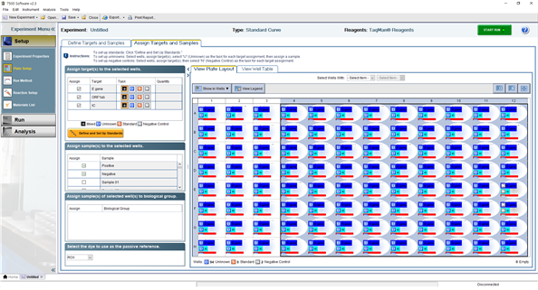

실행하는 Sample의 이름 혹은 Positive, Negative control의 이름을 지정한다.
ABI7500 기기의 리드를 열어 PCR tube를 기기에 넣어 준 후 리드를 닫는다.

좌측 Run 배너를 클릭 후 Start Run을 클릭한다. 저장 경로를 선택한 후 저장하고자 하는 파일 이름을 설정하여 실행한다.

4. 결과 판독

검사가 완료되면 프로그램 상단 export창을 click하고 data export를 수행한다.
   1. ① export button을 click하면 export 파일 type과 저장위치를 정하여 주는 창이 표시 된다.
   
  
   
   2. ②의 저장파일의 type을 정해줄 때. xls로 지정하여 준다.
   3. ③ button을 click하여 export 파일을 저장할 위치를 지정 후 ④ button을 click 한다.
   4. ⑤ 항목에 원하는 data file 명을 입력 후 ⑥ Start export button을 click하여 export를
진행한다.
   5. export 진행 완료 후 ⑦ button을 click 하여 export tool을 닫고 마무리 한다.
   6. COVID-19 viewer

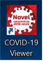

COVID-19 Viewer를 실행한다.

① 실행한 Viewer의 좌측 화살표를 눌러 항목을 선택한 후 File Open 버튼을 클릭한다.

① 앞서 저장한 export data의 파일 위치 및 파일 이름을 확인하여 클릭한다.
② 하단의 열기 버튼을 눌러 실행한다.

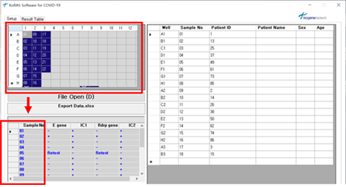

실행된 Viewer의 좌측 상단에는 실험을 진행한 Plate well의 위치를 표기하며, 하단에서는 각 Sample No. 에 따른 target 및 IC의 Positive, Negative가 +, - 로 표기된다.

상단의 Result Table을 클릭한다.

Sample No. 에 따른 target 및 IC의 Ct 값과 Positive, Negative가 +, - 로 표기된다.
IC가 증폭되지 않았을 경우 Retest로 표기된다.

상단의 Print Result를 클릭하면 인쇄하여 결과를 확인할 수 있다.

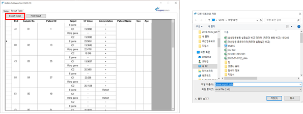

Viewer에 표기된 Patient ID 혹은 +,-의 변경을 원할 경우 상단의 Export Excel을 클릭하여 저장하고자 하는 파일 경로와 파일이름을 설정하여 저장한다.

export 된 excel을 이용하여 편집하여 저장한다.

## 아. 내부정도관리
정도관리물질 : Negative control은 이미 검사된 검체중 음성인 검체 시행한다
Positive control은 kit에서 제공하는 물질로 시행한다.

## 자. 검사해석 (Ct 값 38 이하 양성 판정)
1. SARS-CoV-2 결과판정표

| Case No. |        |      　     |      |             Interpretation            |
|:--------:|:------:|:-----------:|:----:|:-------------------------------------:|
|    　    | E gene | ORF1ab gene |  　  |                   　                  |
|  Case 1  |    +   |      +      | +/-* |            SARS-CoV-2 양성            |
|  Case 2  |    -   |      -      |   +  |            SARS-CoV-2 음성            |
|  Case 3  |    +   |      -      | +/-* |      Inconclusive result (Retest)     |
|  Case 4  |    -   |      +      | +/-* |            SARS-CoV-2 음성            |
| Case 5** |    -   |      -      |   -  | 유효하지   않은 결과/재추출 후 재검사 |

* IC 검출은 시료의 양성 결과에서 필수 조건은 아님. 다른 채널의 우세한 증폭에 의해 IC plot 이 감소되거나 확인이 안 될 수 있음.
** Case 5 와 같이 IC 와 타겟에서 모두 증폭반응이 일어나지 않았을 경우 검체로부터 핵산을 재추출하여 분석할 것을 권장함.

2. 결과분석시 주의사항

|                                           문제                                          |                                            원인                                             |                             조치사항                             |
|:---------------------------------------------------------------------------------------:|:-------------------------------------------------------------------------------------------:|:----------------------------------------------------------------:|
| 프로그램 결과상 아무런 증폭 그래프가 보이지 않는 경우                                   | Positive control은 잘 증폭되었다면 PCR inhibition일 수 있음                                 | 샘플   1/10 희석후 재실험                                        |
| 　                                                                                      | Positive control은 잘 증폭되었다면 해당 well에 primer/probe mix를 첨가하지 않았을 수   있음 | Analysis 창에서 multicom ponent 확인하여 형광이 검출되는지 확인. |
| 　                                                                                      | 　                                                                                          | 형광이 없다면 재실험 형광이 있다면 샘플희석 후 재실험            |
| 　                                                                                      | 냉해동을   10번이상 반복하였거나 배송 및 보관 중 상온에 노출되어 키트의 안정성 저하         | 새로운   키트로 교체                                             |
| Negative control에 서 band가 올라오는 경우                                              | 금번   실험중 양성시료 또는 positive control의 오염                                         | 재실험하면   사라짐                                              |
| Negative control뿐 아니라 모든 well에 서 band가 올라오는 경우                           | Primer/Probe mix가 pipetitng 실수로 인하여 양성물질에 오염                                  | 새로운   Primer/Probe로 교체                                     |
| 　                                                                                      | 실험환경의   오염가능성                                                                     | Cleanbench 락스 1/50 희석액으로 소독필요                         |
| 　                                                                                      | 　                                                                                          | DNA   remover로 소독 필요                                        |
| Positive control이 증폭되지 않는 경우                                                   | Positive control 자체 degradation                                                           | 새로운   positive control교체                                    |
| 장비 구동중 error 메세지                                                                | 대부분   구동중 기기 연결선을 건드렸거나 프로그램내의 충돌로 인한 1회적 현상                | 박테리아와   같이 DNA 키트인 경우는 한시간 이내일 경우 다시구동  |
| 　                                                                                      | 　                                                                                          | 바이러스같이   RNA키트인 경우는 30분 이내일 경우 다시구동        |
| 　                                                                                      | 　                                                                                          | 발견한   시간이 한시간이상 이면 다시 MIX하여 재실험              |
| Negative control에 서 band가 올라오는 경우                                              | 금번   실험중 양성시료 또는 positive control의 오염                                         | 재실험하면   사라짐                                              |
| 증폭그래프의 패턴이 해당그래프와 같은 경우                                              | 기본적으로   설정된 baseline에 비하 여 샘플이 강양성으로 증폭된 경우                        | 양성으로   결과를 내도 무방함                                    |
| 　                                                                                      | 　                                                                                          | 원래대로의 증폭 band를   확인하고 싶으면 baseline을              |
| 　                                                                                      | 　                                                                                          | 3~5사이로   조정                                                 |
| 증폭 band가 곡선이 아닌 찌글거리는 경 우                                                | Positiive control은 괜찮지만 샘플내에 형광을 난반사 시키는 이                               | 샘플   재추출 후 재실험                                          |
| 　                                                                                      | 물질이 들어간 경우                                                                          | 　                                                               |
| Positive control도 찌글거리는 경우                                                      | 기기의   block, 커버의 balance 이상. 기기담당 회사에 연락                                   |                                                                  |
| 프로그램 구동은 되지만 온도가 올라가지 않는 경우                                        | 기기   heat-cover의 고장                                                                    | 기기담당   회사에 연락                                           |
|                                                                                         | 금번   실험중 양성시료 또는 positive control의 오염                                         | DNA remover를 이용하여 실험환경 소독 후 실험 진행                |
|                                                                                         |                                                                                             |                                                                  |
|                                                                                         | 지속적으로 발생할 경우 실험   환경 오염가능성                                               | *단번에   사라지진 않으며, 지속적인 소독을 통해 결과 완화        |
| E gene과 ORF1ab gene중 하나만 Ct 값 35~37사이로 증폭되며, 재검하였을 때 Negative인 경우 | 　                                                                                          | 　                                                               |

3. 검사시 유의사항
   1. 이물질이 혼입될 경우 빛의 산란으로 인한 검출값 오류 발생가능

---
>분자진단 검사지침서

# 5-2. 신종 코로나바이러스(COVID-19) PCR
(STANDARD M nCoV Real-Time Detection kit , 에스디바이오센서)  
**[목차](#목-차)**
## 가. 검사법
Real Time PCR
1. 검사코드 : LPD327
2. EDI코드 : D658404C

## 나. 임상적 의의
코로나바이러스의 유전 물질 (geneticmaterial)은 가축, 애완 동물 및 인간에 질병을 일으키는 병원체로 다양한 급성 및 만성 질환을 유발할 수 있다. 코로나바이러스에 감염된 사람의 일반적인 징후로는 호흡기 증상, 열, 기침, 및 호흡 곤란이 있다. 더 심한 경우 감염은 폐렴, 심각한 급성 호흡기 증후군, 신부전 및 사망을 유발할 수 있다. 2019 New Coronavirus (SARS-CoV-2)는 2019년 중국 우한 지역의 바이러스성 폐렴 사례로 발견되어 2020년 1월 12일 세계보건기구 (WHO)에 의해 명명되었으며 전세계적으로 확산되고 있다. 본 검사는 실시간 역전사중합효소연쇄반응 (Real-time RT-PCR)을 이용한 정성검사이다. 호흡기 감염병 의심환자의 검체(객담, 구인두 및 비인두 가검물)에서 코로나19 바이러스 (2019-nCoV)의 유전자 (E gene, ORF1ab (RdRp) gene)를 정성 검출하여 코로나바이러스감염증–19의 초기 진단을 통해 감염병 확산 방지에 도움이 된다.

## 다. 검사 원리
본 검사는 WHO 2020년 1월 WHO에서 발표한 “WHO interim guidance for laboratory testing for 2019 novel coronavirus (2019-nCoV) in humans” 에 따라 고안된 real-time RT-PCR 검사이다. 코로나바이러스 RNA를 역전사효소를 통해 cDNA로 역전사 시켜 PCR의 template로 사용한다. Screening assay를 위한 E gene (JOE/HEX/VIC channel) 과 SARS-CoV-2의 특이적인 검출을 위한 ORF1ab (RdRp) gene (FAM channel)의 특정서열을 동시에 정성 검출한다. 매 테스트마다 Internal control (CY5 channel)을 포함시켜 RT-PCR 반응의 유효성 여부를 확인할 수 있다.

## 라. 검사의 준비
1. 키트 구성품 (96T/키트) : –25~-15℃ 냉동 보관, 유통기한 제조일로부터 12개월

|    |       구성품 (96T/kit)       |       수량       |
|:--:|:----------------------------:|:----------------:|
|  1 | 2019-nCoV Reaction S olution |  750 ㎕/vial x 2 |
|  2 | RTase Mix                    |  630 ㎕/vial x 1 |
|  3 | 2019-nCoV Positive control   |  600 ㎕/vial x 1 |
|  4 | Negative control             | 600 ㎕L/vial x 1 |
|  5 | Internal control A           |  525 ㎕/vial x 1 |
|  6 | ROX*                         |  55 ㎕/vial x 1  |
|  7 | 사용설명서                   |         1        |

2. 구동 가능 장비
- CFX96™ Real-Time PCR Detection System (Bio-Rad)
- Applied Biosystems 7500 Real-Time PCR Instrument System (Thermo Fisher Scientific)
- Applied Biosystems 7500 Fast Real-Time PCR Instrument System (Thermo Fisher Scientific)

3. 키트 내 포함되지 않으나 필요한 도구
- 마이크로피펫, 팁
- 검체 채취 도구
- 개인용보호구 (PPE, Personal Protectional Equipment)
- 생물학적유해물폐기함
- Viral RNA 추출 시약 (장비)
- PCR reaction tube
- Vortex mixer
- Centrifuge

4. 검체의 종류
- 상기도 검체: 비인두도말, 구인두도말
- 하기도 검체: 객담

## 마. 검체의 채취 및 준비 방법
(모든 검체는 잠재적인 감염성 물질로 취급하여 주의 필요)

[비인두 도말 (Nasopharyngeal swab)]
1. 멸균 스왑을 콧구멍으로 집어넣는다.
2. 멸균 스왑을 비중격을 따라 부드럽게 밀어 넣어 비인두 후면까지 이동시킨다.
3. 멸균 스왑을 비인두 후면 부근의 표면에서 수차례 돌려 준다.
4. 멸균 스왑을 조심스럽게 콧구멍 밖으로 빼낸다.
5. 채취한 즉시 적합한 액체 수송 배지에 담근 후 건조되지 않도록 뚜껑을 닫아 밀봉한다.
6. 수송 배지 (VTM) 내의 도말 검체는 2-8℃에서 5일까지 안정하며, 5일 이상의 장기간 보관 시 –70 °C 이하 보관한다.

[구인두 도말 (Oropharyngeal swab)]
1. 멸균 스왑을 구강을 통해 혀에 닫지 않도록 집어넣는다.
2. 멸균 스왑을 인두의 후벽과 양쪽의 편도선 표면에서 닦아내듯 검체를 채취한다.
3. 채취한 즉시 적합한 액체 수송 배지에 담근 후 건조되지 않도록 뚜껑을 닫아 밀봉한다.
4. 수송 배지 (VTM) 내의 도말 검체는 2-8℃에서 5일까지 안정하며, 5일 이상의 장기간 보관 시 –70 °C 이하 보관한다.

[객담 (Sputum)]
1. 멸균용기에 타액 등이 포함되지 않도록 기침을 유도하여 채취한다.
2. 검체는 오염되지 않도록 주의하여 채취하고 수송 과정에서 새지 않도록 완전히 밀봉 (3중 포장) 한다.
3. 객담 검체는 2-8℃에서 2일까지 안정하며, 2일 이상의 장기간 보관 시 –70 °C 이하 보관한다.

<객담의 전처리>
객담과 동일한 양의 2X Sputum lysis buffer (N-acetylcysteine 10g/L, 0.9% sodium chloride)를 첨가하여 30분간 shaking incubation 시킨 후, 핵산 추출을 진행한다.

바. 핵산 (Viral RNA) 추출
Viral RNA 추출 시약 (장비) 사용설명서에 제시된 방법에 따라 viral RNA를 추출한다.
(추출 효율 (수율 yield, 순도 purity)에 따라 PCR 결과에 영향을 미칠 수 있음)

1. 200㎕의 검체를 추출에 사용한다. (IC를 추출 과정부터 적용 시, 5㎕의 Internal control A를 각 검체에 추가하여 추출을 진행)
2. 핵산 추출이 완료된 후, 핵산 추출 용액을 10분 이내에 real-time PCR reaction tube 에 넣어 핵산 증폭 과정을 진행한다. (핵산 추출물의 장기 보관을 위해 –25℃~ -15℃에 냉동 보관)

사. RT-PCR 실험 방법
1. PCR Mixture 준비
[ CFX96 ]

|                   |                                       시약                                       | 용량 /reaction |
|:-----------------:|:--------------------------------------------------------------------------------:|:--------------:|
|         1         | 2019-nCoV Reaction Solution                                                      |      14㎕      |
|         2         | RTase Mix                                                                        |       6㎕      |
|         3         | Internal control A(증폭부터 적용 시)                                             |      0.5㎕     |
| Total vol. / well | 20.5㎕(증폭부터 적용하는 경우)                                                   | 　             |
|         　        | 20㎕ (추출 시   검체 당 IC 5㎕씩 추가한 경우 , PC/NC well 에만 IC 0.5 ㎕씩 추   1. | 　             |

분쇄된 얼음이 담긴 아이스 박스를 사용하여 반응 검체 수 (N = 테스트 할 검체수 + 컨트롤 2 + 1)에 따라 반응 용액을 준비한다. 아래표와 같이 mixture를 준비하여 real-time PCR reaction tube 각 well에 20.5㎕씩 분주한다. IC를 추출부터 적용할 경우, 검체에 5㎕의 IC를 추가하여 추출을 진행하고 PCR 과정에서는 IC를 제외한 mixture를 각 well에 20㎕씩 분주한다. (PC/NC well에는 IC를 각각 0.5㎕씩 분주)

2. RT-PCR 핵산 증폭
   1. PCR mixture가 분주된 real-time PCR reaction tube 각 well에 검체에서 추출된 핵산을
10㎕씩 분주한다. Positive control (PC), Negative control (NC)로 할당된 well에도 PC와
NC를 각 well에 10㎕씩 분주한다. (오염을 최소화하기 위해 NC > 검체 핵산 > PC 순으
로 분주)
   2. Vortex mixer로 잘 혼합한 후 bubble이 제거되도록 spin-down하여 Real-Time PCR장비
에 지정시킨 well에 장착한다.
   3. 다음 표의 cycle condition을 PCR 장비에 입력하여 반응을 진행시킨다.

|          반응         |       온도 (℃)      |  시간  | 반복 |
|:---------------------:|:-------------------:|:------:|:----:|
| Reverse transcription |         50 ℃        | 15 :00 |   1  |
| Initial denaturation  |         95 ℃        |  3:00  |   1  |
| Pre-amplification     |         95 ℃        |  0:05  |   5  |
|                       |         60 ℃        |  0:40  |      |
| Amplification         |         95 ℃        |  0:05  |  40  |
|                       |         60 ℃        |  0:40  |      |
|                       | 스캔 (FAM/HEX/CY5 ) |        |      |

* AB 7500 / 7500 Fast 기기는 소프트웨어 작동 인터페이스에서 ‘Passive Reference’ 풀다운 메뉴에서 "ROX"를 선택

아. CFX96 Real-Time PCR Detection System 구동 설정 및 결과 판독
1. PCR 구동 설정
   1. CFX Manager Software 열기
   2. Protocol file 불러오기: File > Open > Protocol > Protocol 파일 선택 후 ‘열기’
(Protocol file ‘더블 클릭’하여 열기 가능. 1~2.번 과정 대체)

   3. Protocol 확인 후 ‘OK’ (Sample Volume ‘30㎕’ 고정) > Run Setup > Protocol 탭 하단
‘Next’

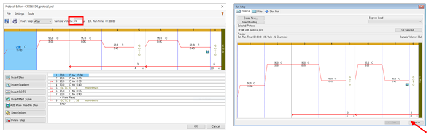

   4. Plate file 불러오기: Run Setup > Plate 탭 > ‘ Select Existing...’ 선택 > 검체 수에 맞
 는 Plate 파일 열기

   5. Plate 확인 후 ‘Next’

   (Plate 설정 변경 시, ‘Edit Selected...’ 클릭하여 설정 변경 후, ‘OK’ > ‘Next’)

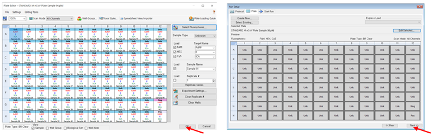

   6. Start Run: Run Setup > Start Run 탭 선택 > 구동 장비 체크 박스 선택
 ‘Open Lid’ 눌러 장비 열고 PCR plate 장착 > ‘ Close Lid’ > ‘Start Run’ 클릭

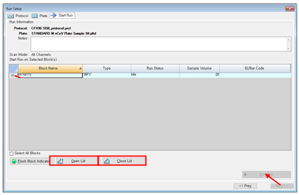

   7. PCR 종료 후 Data 저장할 파일명과 저장 위치 설정 > ‘OK’ > 구동 시작

2. 결과 판독
Auto Threshold로 분석하거나 장비별 결과의 재현성을 위해 해당 장비마다 형광 channel
별로 고정된 Threshold 사용하여 각 Target gene의 Ct 값으로 결과 해석
(PC: 25 Ct ± 1, IC: 23 Ct ± 1 로 분석되는 Threshold 값)
(Baseline 설정이 안 된 경우, Settings > Baseline Setting > Baseline Subtracted Curve Fit
선택)

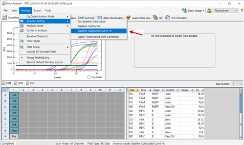

## 자. 결과 해석
분석프로그램으로 해당 실험 Data를 열고, Ct값 분석을 수행한다. 각 target gene에 대한 Ct cut-off는 아래표를 참고한다.

|           Target          | Ct Value |                  결과                  |
|:-------------------------:|:--------:|:--------------------------------------:|
| ORF1ab (RdRp ) gene (FAM) |   Ct≤36  | 2019-nCov ORF1ab (RdRp ) gene positive |
|        E gene (HEX)       |   Ct≤36  |             E gene positive            |
|   Internal Control (CY5)  |   Ct≤32  |        Internal control positive       |

검체 별 각 target gene의 결과에 따라 검사의 유효성과 결과의 해석은 아래표를 참고한다.

| ORF1ab (RdRp ) gene FAM | E gene HEX | Internal Control CY5 |               결과               |
|:-----------------------:|:----------:|:--------------------:|:--------------------------------:|
|         Positive        |  Positive  |   Positive/Negative  |        2019-nCoV positive        |
|         Positive        |  Negative  |   Positive/Negative  |           Inconclusive           |
|         Negative        |  Positive  |   Positive/Negative  | Near-source Coronavirus positive |
|         Negative        |  Negative  |       Positive       |        2019-nCoV negative        |
|         Negative        |  Negative  |       Negative       |         Invalid / Re-test        |

## 차. 내부 정도관리
매 테스트마다 PC와 NC를 각 1well 이상 설정한다. 컨트롤의 테스트 결과는 검체의 결과 해석과 동일한 기준으로 판단하여 아래표의 요구 사항을 충족해야 한다. 요구 사항을 충족하지 않는 경우, 기기, 시약 및 증폭 조건에 오류가 있는지 확인하고 새로운 검체와 새로운 시약으로 재검한다.

|           Control           | ORF1ab (RdRp) gene FAM |  E gene HEX  | Internal Control CY5 |
|:---------------------------:|:----------------------:|:------------:|:--------------------:|
| 2019-nCoV  Positive control |        Positive        |   Positive   |    요구 사항 없음    |
|       Negative control      |      Undetermined      | Undetermined |       Positive       |

 카. Trouble shooting
제조사의 Trouble shooting Guide 참고

---
>분자진단 검사지침서

# 5-3. 신종 코로나바이러스(COVID-19) PCR
(Xpert Xpress SARS-CoV-2, Cepheid)  
**[목차](#목-차)**
## 가. 검사법
Real Time PCR
1. 검사코드 : LPD347
2. EDI코드 : D6584990

## 나. 검사원리
본 제품은 코로나바이러스-19 의심 환자의 비인두 도말 또는 구인두 도말에서 코로나바이러스-19의 N2와 E 유전자를 검출하여 코로나바이러스-19 감염을 확인하는 체외진단의료기기이다. GeneXpert System으로 검사되므로 검체 전처리, 핵산 추출, 증폭 및 실시간 역전사 중합효소연쇄반응법을 통한 Target 유전자 확인까지의 모든 검사과정이 자동으로 이루어진다. 시약 내에는 형광표지물질들이 포함되어 있으며 이 물질들은 증폭산물에 특이적으로 결합하는 올리고핵산염 프로브(probe)에 연결되어 있다. PCR 중에 형광의 강도를 모니터링하여 결과를 도출한다.

## 다. 검체
1. 검체 종류: 비인두 도말, 구인두 도말
2. 검체 채취
      1. 검체 채취용기: Specimen Collection Device
      2. 운반 시 주의사항: 오염에 주의하고 검체 채취 즉시 검사실로 운송한다.
3. 부적합 검체
      1. 검체가 새어나온 검체
      2. 보관 방법(Storage) : 15-30℃에서 8시간, 2-8℃에서 7일 보관한다.
4. 보관 방법
      1. 테스트할 때까지 검체는 15-30℃에서 8시간, 2-8℃에서 7일동안 보관 가능 하다.
      2. 카트리지 개봉 후 30분 이내 검사 시작한다.

## 라. 시약
1. 검사시약명(제조원): Xpert Xpress SARS-CoV-2 (Cepheid)
2. 시약보관(Reagent storage and stability)
   1. Xpert Carba-R 카트리지와 시약은 2-28℃에서 보관한다.

## 마. 검사 장비
1. 검사장비명(제조원): GeneXpert DX system(Cepheid)
2. 파이펫

## 바. 정도관리
1. 정도관리 물질
Sample processing control / internal control (SPC/IC) :SPC/IC는 dry bead 형태로카트
리지 안에 포함되어있다. Target이 충분히 용해됐는지, Sample processing, detects assay
interference를 확인한다. GeneXpert DX system software는 SPC/IC를 CIC라 한다.
2. 정도관리시행
매 검사 시마다 CIC를 사용하여, 환자 검체와 함께 카트리지 내에서 자동 시행되며,CIC가
정확한 결과 값을 낸 검체의 결과만을 임상에 보고한다. 키트의 LOT 변경 시,이전 LOT로
양성이 나온 검체를 이용하여 LOT 변경 후 검사에도 동일한 결과가 나오는지 검사한다.

## 사. 검사방법
1. 장비 준비
   1. GeneXpert 장비를 켠 후, 노트북을 켠다.
   2. 맨 왼쪽 Cepheid 클릭 후, 비밀번호 “cphd”를 넣고 로그인 하게 되면 GeneXpert DX소
프트웨어는 자동 실행된다.
   3. “Do you want to perform Database Management task?” 및 기타 창이 뜨면 No 버튼
을 누른다.
   4. 장비와 컴퓨터 간 정상적으로 연결이 되면 Self-testing이 진행되며, 장비의 Self testing
이 완료되면 Module의 Progress가 Booting에서 Available로 변경됐는지 확인한다.

2. 카트리지 준비
   1. 포장용기에서 카트리지와 시약을 꺼낸다.
   2. Specimen Transport Tube의 뚜껑을 잘 닫아준다.
   3. Specimen Transport Tube를 5회 빠르게 뒤집어 섞어준다.
   4. Specimen Transport Tube의 뚜껑을 열어준다.
   5. Kit에 제공 된 일회용 파이펫의 윗 부분을 완전히 누른 상태에서 파이펫 끝을 Specimen
Transport Tube에 넣어준다.
   6. 누르고 있는 일회용 파이펫의 윗부분을 살살 놓아주며 Overflow Reservoir Bulb 부분까
지 검체를 빨아들여준다. (이때 공기방울이 함께 들어가지 않도록 주의한다.)
   7. 카트리지의 뚜껑을 열어 카트리지의 “Sample Chamber” (가장 큰 구멍) 칸에 검체를 넣
어준다.
   8. 카트리지의 뚜껑을 닫는다.
   자. Genexpert System에 장착하여 검사를 진행한다.

3. 검사 시작 준비
   1. GeneXpert System 창에서, Create Test를 클릭한다.
   2. 환자 ID 를 스캔 하거나 수기로 입력한다. (선택)
   3. Sample ID를 스캔 하거나 수기로 입력한다. (선택)
   4. "Scan Cartridge Barcode dialog" 창이 나타나면 카트리지에 있는 바코드를 스캔 한다.
바코드 정보를 사용하여 software 는 시약의 Lot ID, 카트리지 일련번호, 유통기한 등을
자동으로 입력해준다.
   5. Start Test 버튼을 클릭한다.
   6. 선택한 모듈 문을 열고 카트리지를 삽입한다.
   7. 녹색 불이 깜빡일 때, 모듈 문을 닫으면 검사가 시작되며, 검사가 끝나면 녹색등이 꺼지
며 저절로 문이 열린다.

4. 장비 정리
   1. GeneXpert DX 소프트웨어를 종료 하기 위해 X버튼을 누르고 “ Do you want to
perform Database Management task?” 및 기타 창이 뜬다면 No 버튼을 누른다.
   2. 노트북 종료 후 장비를 끈다.

## 아.참고치
Negative

## 자. 결과해석 및 보고
1. Target DNA : N2 gene, E gene
2. Probe Ct값 유효 범위

| Probe | N2 |  E | SPC |
|:-----:|:--:|:--:|:---:|
|  범위 | 45 | 45 |  45 |

3. 결과 해석
   1. SARS-CoV-2 POSITIVE
신종코로나바이러스 (SARS-CoV-2)의 Target 유전자가 검출되었음
SARS-CoV-2의 Target 유전자인 N2 또는 N2와 E 유전자가 동시에 유효 범위 내에 Ct 값
을 가지며, 마지막 결과(EndPt)는 설정된 최소값 보다 높음
SPC : NA (해당 사항 없음). 신종코로나바이러스 Target 유전자 증폭이 발생하였기 때
문에 SPC 신호는 무시함
Probe Check : PASS. 모든 Probe 검사 적합

   2. SARS-CoV-2 PRESUMPTIVE POSITVE
신종코로나바이러스 (SARS-CoV-2)의 Target 유전자가 존재 할 수 있음
SARS-CoV-2의 Target 유전자인 E 유전자만 유효 범위 내에 Ct 값을 가지며, 마지막 결과
(EndPt)는 설정된 최소값 보다 높음
SPC : NA (해당 사항 없음). 신종코로나바이러스 Target 유전자 증폭이 발생하였기 때
문에 SPC 신호는 무시함
Probe Check : PASS. 모든 Probe 검사 적합
이 경우 재검사 절차를 따라 재검을 수행해야 함
반복적으로 PRESUMPTIVE POSITVE가 보고되는 검체는 필요한 경우 역학 조사 또는 임상
관리를 위해 SARS-CoV-2, SARS-CoV-1 또는 사람을 감염시킬 수 있으며 알려지지 않은
새로운 Sarbecovirus 인지 구별하기 위해 추가 실험을 수행할 수 있음

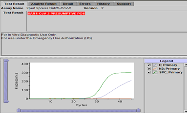

   3. SARS-CoV-2 NEGATIVE
신종코로나바이러스 (SARS-CoV-2)의 Target 유전자가 검출되지 않음
2개의 SARS-CoV-2의 Target 유전자 (N2 및 E) 유전자가 유효 범위 내에 Ct 값을 갖지
않고, 마지막 결과(EndPt)는 설정된 최소값 보다 높음
SPC : PASS. SPC는 설정된 최소값 보다 높은 최종 결과(EndPt)값을 가지며 Ct가 유효 범
위내에 있음Probe Check : PASS. 모든 Probe 검사 적합

   4. 재검이 필요 한 상황
      1. INVALID : SPC Ct값이 유효범위에 존재하지 않는 경우 나타난다. 검사가 적절히
 진행되지 않았거나, PCR이 억제되었을 때 나타난다.
      2. ERROR : probe test를 실패하였을 때, 압력 한계를 초과하였을 때 밸브의 위치가
 비정상일 때 등 나타난다. ERROR가 나타나면, 검사는 중단된다.
      3. NO RESULT : 검사결과가 불충분 할 때 나타난다.
 (예; 검사자가 실험을 중단 시킬 때)

   5. 재검방법
      1. Kit에서 새 카트리지와 Sample Reagent를 꺼낸다.
      2. 기존 검사에서 남은 검체를 사용하여 3)의 검사과정을 따라 검사를 진행한다.

## 차. Data 관리
1. PDF file로 결과 저장 방법
   1. View result (상단 왼쪽 네 번째)를 클릭한 후 결과 화면 하단에 있는 Report를 누른다.
   2. PDF file을 만들고자 하는 검사를 체크 표시 한 다음 Generate report file을 눌러 파일
을 만든다. (Preview PDF 는 미리 보기)
2. 결과 그래프 출력 방법
   1. 결과 그래프 창에 마우스를 대고 오른쪽 버튼을 클릭하면 그래프 저장 탭이 나타난다.
   2. PDF 혹은 JPG 파일로 저장하여 출력한다.
3. 데이터 날짜별 저장 방법
   1. GeneXpert 프로그램 실행 후 맨 위 탭의 두 번째 “Data Management”를 클릭한 후
“archive test”를 클릭한다.
   2. 날짜별로 저장하고자 하는 검사를 선택한 다음 “OK”를 누른다. (선택한 검사를 전체 검
사목록에서 삭제하고자 하면 맨 오른쪽에 “Delete Archived Tests”를 체크 표시 한다.)
   3. "Proceed”를 클릭한다.
   4. 저장할 곳을 지정한 다음 저장한다.

4. 날짜별로 저장한 데이터 불러오는 방법
   1. GeneXpert 프로그램 실행 후 맨 위 탭의 두 번째 “Data Management”를 클릭한 후
“Retrieve test”를 클릭한다.
   2. 불러 오고자 하는 파일을 (확장명은 .gxx) 선택한 다음, “Open”을 클릭한다. 화면이 나타
나면 날짜별로 저장하고자 하는 검사를 선택한다.
   3. “OK”를 누르고 나면 창이 뜨게 되는데, 이때, 불러오고자 하는 검사를 선택한 다음 창
아래 있는 “OK”버튼을 클릭한다.(불러오기 할 때 저장된 모든 검사를 불러오고자 할 때는
“select all”을, 일부만 선택 하고자 할 때는 체크표시 하여 진행한다.)
   4. 새로운 창이 뜨면 “Proceed”를 누른다. 성공적으로 retrieve 되었다는 창이 뜨면
   5. “OK”를 클릭한다.
   6. View Result- View test 창에 검사가 삽입되었는지 확인 한다.

## 카. 검사의 한계
1. 본 제품은 긴급사용승인제품으로 응급시에만 사용한다.
2. 양성결과는 SARS-CoV-2 RNA가 존재함을 나타낸다.

---
>분자진단 검사지침서

# 5-4. 신종 코로나바이러스(COVID-19) PCR
(BioSewoom, Real-Q Direct SARS-CoV-2 Detection Kit)  

**[목차](#목-차)**

## 가. 검사법
Real Time PCR
1. 검사코드 : LPD347
2. EDI코드 : D6584990

## 나. 검사원리
Real-Q Direct SARS-CoV-2 Detection Kit 은 호흡기 감염병 의심환자의 검체(비인두 및 구인두 가검물)에서 추출된 RNA를 사용하여 cDNA 합성 과정 없이 SARS-CoV-2의 유전자(RdRP gene, E gene) 매우 특이성 있고 민감하게 검출할 수 있는 제품으로 사용하도록 제조되었다.
RdRP gene의 증폭을 위하여 5’ end에 FAM, 3’ end는 SFC Q1이 부착된 probe를 사용하고 있다. E gene 의 증폭을 위하여 5’ end에 HEX, 3’ end는 SFC Q1이 부착된 probe를 사용하고 있다. 그리고 5’ end에 CY5, 3’ end에 Iowa Black이 부착된 probe를 사용하여 internal control 유전자를 증폭하도록 제작되었고, internal control 유전자는 Human RNase P 유전자를 증폭하도록 고안되어 전체 실험과정의 오류를 확인할 수 있다.

## 다. 검체
1. 검체 종류: 비인두 도말, 구인두 도말
2. 검체 채취
   1. 검체 채취용기: Specimen Collection Device
   2. 운반 시 주의사항: 오염에 주의하고 검체 채취 즉시 검사실로 운송한다.
3. 부적합 검체
   1. 검체가 새어나온 검체
   2. 보관 방법(Storage) : 15-30℃에서 8시간, 2-8℃에서 7일 보관한다.
4. 보관 방법
   1. 테스트할 때까지 검체는 15-30℃에서 8시간, 2-8℃에서 7일동안 보관 가능 하다.
   2. 카트리지 개봉 후 30분 이내 검사 시작한다.

## 라. 시약
1. 검사시약명(제조원): BioSewoom, Real-Q Direct SARS-CoV-2 Detection Kit
2. 시약보관(Reagent storage and stability)
   1. Tube와 시약은 -20℃에서 보관한다.

 |  Tube/Cap    |  Label                            |  Contents                                                                                                      |
|--------------|-----------------------------------|----------------------------------------------------------------------------------------------------------------|
|  1 / White   |  8-strip                          |  1T x 100  PCR reaction mixture, Primer and TaqMan  probe mixture(specific for COVID-19 and  IC amplification) |
|  2 / Blue    |  Positive control                 |  50 µl                                                                                                         |
|  3 / Neutral |  Water, sterile, DNase/RNase free |  1000 µl                                                                                                       |

Note : 8-Strips에는 PCR reaction mixture, probe & primer mixture, enzyme mixture가 포함되어 있다.

모든 구성물은 사용직전에 꺼내어 해동 후 가볍게 원심분리 하여 사용한다.

## 마. 검사 장비
1. 검사장비명(제조원): ABI 7500 (ThermoFisher)
2. 파이펫

## 바. 정도관리
1. 정도관리 물질
제품에 포함된 Positive control, Negative control (Water, sterile, DNase/RNase free)를 사용한다.
2. 정도관리시행
매 검사 시마다 제품에 포함된 Positive control, Negative control (Water, sterile, DNase/RNase free)와 internal control 유전자는 Human RNase P유전자를 증폭하도록 고안되어 전체 실험과정의 오류를 확인한다.

## 사. 검사방법
1. 검사하고자 하는 검체 수에 맞도록 킷 내 strip tube를 가져온다. Strip tube내 용액이 녹으
면 반드시 원심분리를 실시하여 내용물을 아래로 모은 후 검사에 사용한다.
* 총 필요한 strip tube well수 = n sample + 1 positive control+ 1 negative control
2. Sample RNA와 positive control, negative control을 각각의 지정된strip tube well에 5 μl씩
분주한다.
3. 분주가 끝난 strip tube는 cap으로 잘 닫아준 후 가볍게 원심분리 한다.
4. Real time PCR 장비에 strip tube를 장착한 후 장비별로 아래의 조건으로 검사를 진행한다.
5. PCR condition

< Applied Biosystems 7500 fast>

| Step | 온도  | 시간   | Cycle #   | Acquisition mode |
|------|-------|--------|-----------|------------------|
| 1    | 50 °C | 10 min | 1 cycle   | 　               |
| 2    | 95 °C | 3 min  | 1 cycle   | 　               |
| 3    | 95 °C | 10 sec | 3 cycles  | 　               |
|      | 62 °C | 20 sec |           |                  |
| 　   | 　    | 　     | 　        | Not acquiring    |
| 4    | 95 °C | 10 sec | 40 cycles | Acquiring on     |
| 　   | 62 °C | 30 sec | 　        | FAM ,VIC,Cy5     |

Note : Reporter 에는 FAM, VIC, Cy5로 지정하고, Quencher는 모두 None으로 설정한다.
PCR reaction mixture에 passive reference dye가 포함되어 있지 않으므로 passive reference를 “None” 으로 지정한다.

## 아.참고치
Negative

자. 결과해석 및 보고
1. Target DNA
2. Probe Ct값 유효 범위

| FAM Ct (RdRP gene) | HEX/VIC Ct (E gene) | Cy5 (HRP) |
|--------------------|---------------------|-----------|
| ≤38                | ≤38                 | ≤35       |

3. 결과 해석
   1. SARS-CoV-2 POSITIVE

## 자. Data 관리

## 차. 검사의 한계
1. 본 제품은 긴급사용승인제품으로 응급시에만 사용한다.
2. 양성결과는 SARS-CoV-2 RNA가 존재함을 나타낸다.

| FAM    | HEX/VIC    | Cy5  |               |                    |
|--------|------------|------|---------------|--------------------|
| (RdRP) | (E   gene) | (IC) | Result        | Comment            |
| +      | +          | +/-  | 2019-nCoV양성 |                    |
| +      | -          | +/-  | Inconclusive  | 재검을   권장한다. |
| -      | +          | +/-  | Inconclusive  | 재검을   권장한다. |
| -      | -          | +    | 음성          |                    |
| -      | -          | -    | Invalid       | 재검을   실시한다. |

---
>분자진단 검사지침서

# 5-5. 신종 코로나바이러스(COVID-19) PCR
(STANDARD™ M10 SARS-CoV-2)

**[목차](#목-차)**

## 가. 검사법
Real Time PCR
1. 검사코드 : LPD347
2. EDI코드 : D6584990

## 나. 검사원리
신종 코로나바이러스(SARS-CoV-2)의 확인을 위하여 STANDARD™ M10 (실시간유전자증폭장치)를 이용하여 핵산 추출부터 증폭 및 분석까지 진행되는 통합 자동화 시스템에 사용되는 카트리이다.
STANDARD™ M10 SARS-CoV-2는 카트리지 형태로 핵산 추출에 필요한 시약들이 포함되어 있 으며 유리섬유(glass fiber filter; 실리카 기반 막)에 핵산 흡착 방식을 통해 검체로부터 바이러 스 RNA를 정제합니다.
정제된 RNA는 신종 코로나바이러스의 특정 서열에 결합하는 프라이머 (primer)와 형광 표지된 TaqMan 프로브(probe)를 사용하여 실시간 역전사중합효소연쇄반응 (Real-Time Reverse Transcription Polymerase Chain Reaction) 방식을 통해 증폭 및 검출된다.

## 다. 검체
1. 검체 종류: 비인두 도말, 구인두 도말
2. 검체 채취
   1. 검체 채취용기: Specimen Collection Device
   2. 운반 시 주의사항: 오염에 주의하고 검체 채취 즉시 검사실로 운송한다.
3. 부적합 검체
   1. 검체가 새어나온 검체
   2. 보관 방법(Storage) : 15-30℃에서 8시간, 2-8℃에서 7일 보관한다.
4. 보관 방법
   1. 테스트할 때까지 검체는 15-30℃에서 8시간, 2-8℃에서 7일동안 보관 가능 하다.
   2. 카트리지 개봉 후 30분 이내 검사 시작한다.

## 라. 시약
1. 검사시약명(제조원): STANDARD™ M10 SARS-CoV-2
2. 시약보관(Reagent storage and stability)
   1. M10 SARS-CoV-2 카트리지와 시약은 2-28℃에서 보관한다.

## 마. 검사 장비
1. 검사장비명(제조원): STANDARD™ M10 (체외 제인 20-5010호, 실시간유전자증폭장치)
2. 파이펫

## 바. 정도관리
1. 정도관리 물질
Sample processing control / internal control (SPC/IC) :SPC/IC는 dry bead 형태로카트리지 안에 포함되어
있다.
Target이 충분히 용해됐는지, Sample processing, detects assay interference를 확인한다. GeneXpert DX
system software는 SPC/IC를 CIC라 한다.
2. 정도관리시행
매 검사 시마다 CIC를 사용하여, 환자 검체와 함께 카트리지 내에서 자동 시행되며,CIC가
정확한 결과 값을 낸 검체의 결과만을 임상에 보고한다. 키트의 LOT 변경 시,이전 LOT로
양성이 나온 검체를 이용하여 LOT 변경 후 검사에도 동일한 결과가 나오는지 검사한다.

## 사. 검사방법

1. STANDARDSTANDARD™ M10 시스템 시작
   

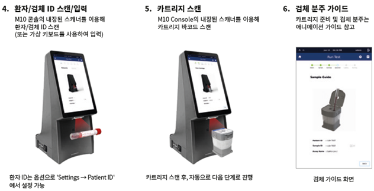

1. 카트리지에 검체 분주
   
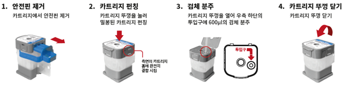

1. 검사 수행
   

## 아. 참고치
Negative

## 자. 결과해석 및 보고
1. Target DNA

|   검출 타겟    | 형광 |
|:--------------:|:----:|
| ORF1ab 유전자  |  FAM |
|    E 유전자    |  HEX |
|  내부대조물질  |  Cy5 |

2. 결과 해석
   
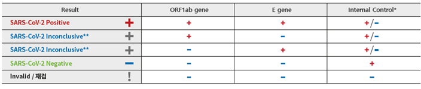

* 타겟이 강양성인 경우 IC 음성으로 판독될 수 있습니다. IC 결과 배제하고 양성으로 결과 판독 합니다.
* 두 가지 유전자 중 한 가지만 양성 (Inconclusive): 일반 Real-Time PCR 실시하여 확인 합니다.

## 차. Data 관리
1. 인터페이스 프로그램을 이용한 결과전송방법

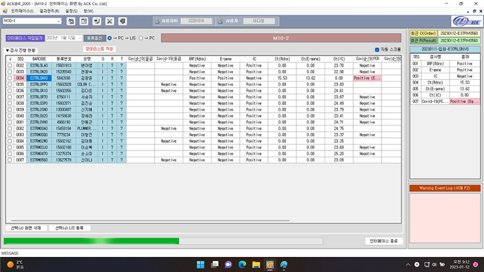

-
   1. Negative 인 결과는 자동보고된다.
   2. Positive ( ct <= 35 ) 인 경우는 중간보고 형태로 저장한다.
검체바코드를 이용하여 [nU>검체별 결과관리] 화면을 통해 결과 적정성을 재 확인 후 이상이 없을 경우 최
종 보고한다.
   3. Positive ( ct > 35 ) 인 경우는 중간보고 형태로 저장한다.
검사의뢰과나 병동에 재검시행을 공지한후 검체는 일반 PCR 렉으로 이동시킨다.
   4. 판정보류인 경우는 결과를 보고하지 않은 상태로 검사의뢰과나 병동에 재검시행을 공지한후 검체는 일반 PCR 렉으로 이동시킨다.
   5. Invalid, Failure 인 경우는 결과를 보고하지 않은 상태로 검사의뢰과나 병동에 재검시행을 공지한후 검체
는 일반 PCR 렉으로 이동시킨다.

## 카. 검사의 한계
1. 본 제품은 긴급사용승인제품으로 응급시에만 사용한다.
2. 양성결과는 SARS-CoV-2 RNA가 존재함을 나타낸다.

